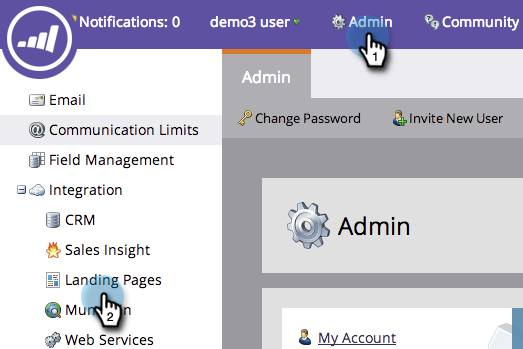

# 為您的帳戶啟用個人化URL（管理）{#enable-personalized-urls-for-your-account-administration}

個人化URL非常適合印刷郵件宣傳。

>[!NOTE]
>
>**需要管理員權限**

1. 前往&#x200B;**Admin**，然後按一下「著陸頁面」**。**

   

1. 按一下&#x200B;**編輯**。

   

1. 選中&#x200B;**啟用個性化URL**&#x200B;框，然後按一下&#x200B;**保存**。

   

幹得好！ 現在您已為您的帳戶啟用PURL，您可以[為個別著陸頁面](/help/marketo/product-docs/demand-generation/landing-pages/personalizing-landing-pages/enable-personalized-urls-for-a-landing-page.md)啟用它們。

>[!NOTE]
>
>如果有兩個人擁有相同的名字／姓氏，系統會自動在結尾附加一個數字。
