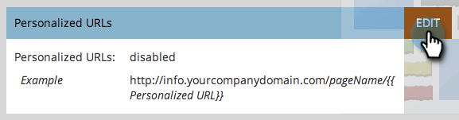

# 為您的帳戶啟用個人化URL {#enable-personalized-urls-for-your-account}

個人化URL非常適合列印郵件行銷活動。

>[!NOTE]
>
>**需要管理員許可權**

1. 移至&#x200B;**[!UICONTROL 管理員]**&#x200B;區域。

   

1. 按一下&#x200B;**[!UICONTROL 登陸頁面]**。

   

1. 按一下&#x200B;**[!UICONTROL 編輯]**。

   

1. 勾選&#x200B;**[!UICONTROL 啟用個人化URL]**&#x200B;方塊，然後按一下&#x200B;**[!UICONTROL 儲存]**。

   

做得好！現在您已為帳戶啟用PURL，您可以[為個別登入頁面啟用PURL](/help/marketo/product-docs/demand-generation/landing-pages/personalizing-landing-pages/enable-personalized-urls-for-a-landing-page.md)。

>[!NOTE]
>
>如果有兩個人擁有相同的名字/姓氏，系統會自動在結尾附加一個數字。
