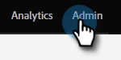

# 全局表單驗證規則 {#global-form-validation-rules}

此功能允許您阻止特定域提交到Marketo Engage表單。

## 如何啟用訪問 {#how-to-enable-access}

在使用此功能之前，必須按所需角色啟用其權限。

1. 在Marketo，按一下 **管理**。

   

1. 按一下 **用戶和角色**。

   

1. 按一下 **角色** 頁籤。

   

1. 按兩下要授予權限的角色。

   

1. 按一下 **+** 在「Access Admin（訪問管理）」旁邊簽名。

   

1. 向下滾動並選擇 **訪問表單驗證規則** 按一下 **保存**。

   

## 建立新表單驗證規則 {#create-new-form-validation-rule}

>[!IMPORTANT]
>
>這些規則將應用於Marketo Engage訂閱中的所有表單。

1. 在Marketo，按一下 **管理**。

   

1. 按一下 **全局表單驗證規則**。

   

1. 按一下 **新建窗體驗證規則**。

   

   >[!NOTE]
   >
   >「表單驗證規則操作」(Form Validation Rule Actions)下拉清單允許您刪除或編輯現有規則。

1. 將規則命名，給出可選說明，並輸入您希望表單訪問者看到的錯誤消息。 在規則框中輸入要阻止的域，選擇 **激活規則**，然後按一下 **建立**。

   

>[!NOTE]
>
>Marketo Engage有一個定義的免費使用者電子郵件域的阻止清單，當使用我們預載入的「使用者電子郵件域阻止清單」規則時，這些阻止清單將被阻止。 [在此處查看該清單](/help/marketo/product-docs/administration/settings/assets/freemaildomains.csv)。
