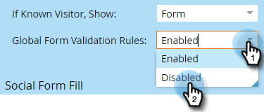

# 全域表單驗證規則 {#global-form-validation-rules}

此功能可讓您阻止特定網域提交至Marketo Engage表單。

## 如何啟用存取 {#how-to-enable-access}

您必須先根據所需角色啟用其權限，才能使用此功能。

1. 在Marketo中，按一下 **管理**.

   

1. 按一下 **使用者與角色**.

   

1. 按一下 **角色** 標籤。

   

1. 連按兩下您要授予權限的角色。

   

1. 按一下 **+** 登入「存取管理員」旁。

   

1. 向下捲動並選取 **存取表單驗證規則** 按一下 **儲存**.

   

## 建立新的表單驗證規則 {#create-new-form-validation-rule}

>[!IMPORTANT]
>
>這些規則將適用於Marketo Engage訂閱中的所有表單。

1. 在Marketo中，按一下 **管理**.

   

1. 按一下 **全域表單驗證規則**.

   

1. 按一下 **新表單驗證規則**.

   

   >[!NOTE]
   >
   >「表單驗證規則動作」下拉式清單可讓您刪除或編輯現有規則。

1. 為規則命名、提供選用說明，並輸入您希望表單訪客看到的錯誤訊息。 在規則框中輸入要阻止的域，選擇 **啟動規則**，然後按一下 **建立**.

   

>[!NOTE]
>
>Marketo Engage有已定義的免費消費者電子郵件網域封鎖清單，當使用預先載入的「消費者電子郵件網域封鎖清單」規則時，這些網域會遭到封鎖。 [在此處查看該清單](/help/marketo/product-docs/administration/settings/assets/freemaildomains_2023.csv).

## 如何停用每個表單的存取權{#how-to-disable-access-per-form}

啟用後，規則會套用至所有表單。 但是，如果您的表單有特定需求，而且您不希望任何項目遭到拒絕，則可以在表單的設定中停用「全域表單驗證規則」。

1. 在您需要的表單中，按一下 **表單設定**，然後 **設定**.

   

1. 按一下「全域表單驗證規則」下拉式清單，然後選擇 **已停用**.

   

當您核准並張貼表單時，表單會忽略您的全域表單驗證規則。
