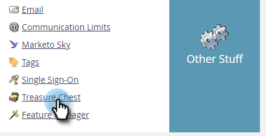

# 如何阻止垃圾郵件表單提交{#how-to-block-spam-form-submissions}

通常，具有無效或缺失校驗和的表單提交（通常來自機器人）可能會生成錯誤統計資訊。 這是如何防止的。

>[!CAUTION]
>
>此功能拒絕使用程式化POST提交到leadCapture/save2端點的表單。 如果您的企業運用整合方式，以該方式將表單提交至Marketo，啟用此功能將會封鎖這些提交。 不支援並禁止使用leadCapture/save2做為API或直接執行程式化表單提交。 請確保您的企業僅使用下列方式提交表格：表單資產、內嵌表單程式碼、Forms2.js API或提交表單REST API。

1. 按一下&#x200B;**管理**。

   

1. 按一下&#x200B;**Treasure Chest**。

   

1. 在&#x200B;**Person Capture - Reject Invalid Checksum Values**&#x200B;旁邊，按一下&#x200B;**Edit**。

   

1. 選中&#x200B;**Enabled**&#x200B;複選框，然後按一下&#x200B;**Save**。

   

>[!NOTE]
>
>啟用此功能後，您可能會在篩選出假數時看到表單活動的下降。
