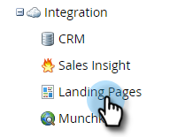

# 登錄頁標題 {#landing-page-headers}

按照以下步驟自定義登錄頁域上的某些HTTP標頭。

1. 在Marketo，按一下 **管理**。

   

1. 按一下 **登錄頁**。

   

1. 按一下 **編輯** 登錄頁HTTP標頭旁邊。

   

1. 選擇所需設定並按一下 **保存** 完成。

   

<table>
 <tr>
  <td><strong>嚴格傳輸 — 安全</strong></td>
  <td>使用此選項可確保始終通過HTTPS提供到登錄頁的連接（應僅為登錄頁受SSL保護的訂閱設定）</td>
 </tr>
 <tr>
  <td><strong>X幀選項</strong></td>
  <td>用於定義Marketo Engage托管資產是否可嵌入到外部網頁中</td>
 </tr>
</table>

>[!CAUTION]
>
>與您的IT團隊一起查看這些設定以確定您組織的策略應設定為什麼非常重要。 不正確的設定可能會阻止某些訪問者訪問您的登錄頁。
