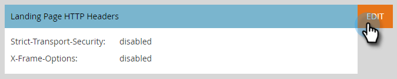
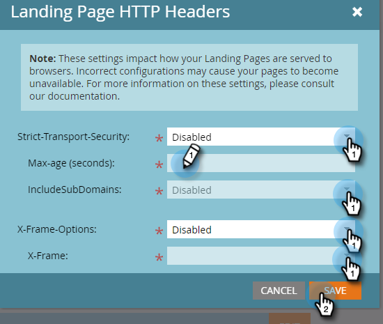

# 登陸頁面標頭 {#landing-page-headers}

請依照下列步驟，自訂您的登陸頁面網域上的部分HTTP標題。

1. 在Marketo中，按一下&#x200B;**[!UICONTROL Admin]**。

   

1. 按一下「**[!UICONTROL Landing Pages]**」。

   

1. 按一下登陸頁面HTTP標題旁的&#x200B;**[!UICONTROL Edit]**。

   

1. 選擇您想要的設定，完成時按一下&#x200B;**[!UICONTROL Save]**。

   

<table>
 <tr>
  <td><strong>[!UICONTROL Strict-Transport-Security]</strong></td>
  <td>使用此專案來保證登陸頁面的連線一律會透過HTTPS提供（應僅針對具有SSL安全保護的登陸頁面的訂閱設定）</td>
 </tr>
 <tr>
  <td><strong>[!UICONTROL X-Frame-Options]</strong></td>
  <td>可讓您定義Marketo Engage託管的資產是否可內嵌在外部網頁中</td>
 </tr>
</table>

>[!CAUTION]
>
>請務必與IT團隊一起檢閱這些設定，以決定您組織的原則應設定為何。 不正確的設定可能會讓某些訪客無法存取您的登陸頁面。
