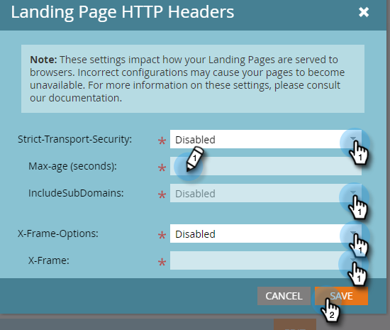

# 登陸頁面標題 {#landing-page-headers}

請依照下列步驟，在您的登陸頁面網域上自訂部分HTTP標題。

1. 在Marketo中，按一下 **管理**.

   

1. 按一下 **登錄頁面**.

   

1. 按一下 **編輯** 在「登陸頁面HTTP標題」旁。

   

1. 選擇您想要的設定，然後按一下 **儲存** 時才能使用。

   

<table>
 <tr>
  <td><strong>嚴格傳輸安全</strong></td>
  <td>使用此功能可保證連線至登錄頁面一律會透過HTTPS提供（僅應針對使用SSL安全之登錄頁面的訂閱設定）</td>
 </tr>
 <tr>
  <td><strong>X-Frame-Options</strong></td>
  <td>可讓您定義Marketo Engage托管資產是否可內嵌於外部網頁</td>
 </tr>
</table>

>[!CAUTION]
>
>請務必與IT團隊一起檢閱這些設定，以決定您組織的原則應設定為什麼。 不正確的設定可能會使部分訪客無法存取您的登錄頁面。
