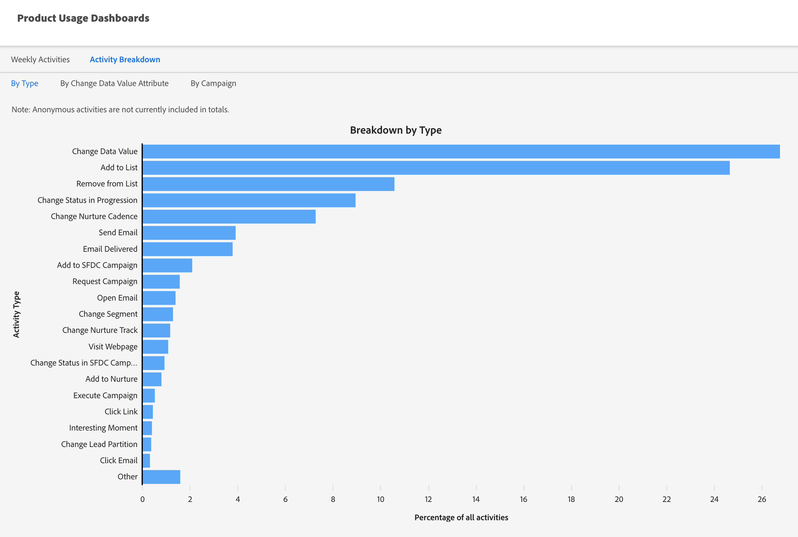

# 產品使用情況儀表板 {#product-usage-dashboards}

Marketo Engage產品使用情況儀表板可讓您根據特定限制或待處理資料輸送量、每日配額的使用情況以及訂閱中的關鍵量度，檢視產品和平台使用情況。 配置基礎架構是為了提供針對特定屬性的產品層級定義的效能限制。 其中有些限制（例如API使用情況）是作為套件或產品層級的一部分購買的合約限制。

## 如何存取 {#how-to-access}

1. 在Marketo Engage中，按一下&#x200B;**管理員**。

   

1. 在左側的樹狀結構中，向下捲動並選取&#x200B;**產品使用控制面板**。

   

## 活動使用情況儀表板 {#activity-usage-dashboard}

### 平均每週活動 {#average-weekly-activities}

「每週活動使用量」控制面板提供累計52週期間內的活動型別每週計數。 每週產生的活動是您在Marketo Engage中進行多少行銷的良好指標。 活動可作為Marketo內發生之各種系統流程和可追蹤事件的代理。

活動型別包含人員/潛在客戶與行銷事件互動時所擷取的活動計數，以及流程動作所觸發的系統型活動。 個人啟動活動的一些範例是，當收件者開啟您傳送的電子郵件時，或按一下電子郵件中的連結時。 流程動作所觸發的系統式活動的範例是，當觸發程式啟動時，_傳送至SFDC_。

>[!TIP]
>
>若要檢視特定周的活動型別計數，請將滑鼠移至所需的一週上，計數就會顯示。

{width="800" zoomable="yes"}

#### 常見問題集 {#faq}

**計算哪些活動型別？**

這取決於管道中包含哪些活動。

**是否同時包含已知和匿名的人員/潛在客戶活動？**

僅限已知人員/銷售機會。

**資料重新整理的頻率為何？**

活動計數每天早上都會重新整理。

## 活動劃分 {#activity-breakdown}

我們在這裡會根據有意義的資料切片，取得過去七天的活動計數。 依過去七天內最常見的活動型別將活動分組。 這可能包括&#x200B;_變更資料值_、_新增至清單_&#x200B;或&#x200B;_傳送電子郵件_&#x200B;等類別。 這可讓您檢視系統中最常發生的活動型別。 活動型別使用量是決定成長或是否需要最佳化以減少使用量的關鍵指標。

>[!NOTE]
>
>* 以下所有劃分都是滾動七天總和，且&#x200B;**不**&#x200B;包含當天。 所以請將其視為「昨天+之前六天」。
>
>* 儀表板只會顯示前20個活動型別，而其餘活動型別會排序到名為「其他」的類別中。

活動使用方式可顯示正在執行多少行銷，並有助於對照已識別之合約產品層級以視覺化方式成長。 儀表板也可用作為指南，以透過減少正在更新的欄位來決定可以/應該進行多少最佳化。

### 依型別 {#by-type}

依過去七天內最常見的活動型別將活動分組。 這可能包括&#x200B;_變更資料值_、_新增至清單_&#x200B;或&#x200B;_傳送電子郵件_&#x200B;等類別。 這可讓您檢視Marketo Engage帳戶中最常發生的活動型別。

{width="600" zoomable="yes"}

### 透過變更資料值屬性 {#by-change-data-value-attribute}

_變更資料值_&#x200B;是最常見的活動型別。 這表示人員/潛在客戶記錄上的資訊何時更新。 在此處，我們會根據最常變更的欄位進行分組，以便您判斷哪些資訊對行銷作業有用、是否有機會最佳化平台使用率等。

{width="600" zoomable="yes"}

### 依行銷活動 {#by-campaign}

行銷活動產生最多活動的群組。 這可讓您檢視是否有任何特別「嘈雜」的行銷活動，其建立的活動多於必要的活動。 快速瞭解應停止運作的行銷活動，或執行的工作超出預期的行銷活動。

{width="600" zoomable="yes"}

### 依Source （即將推出） {#by-source}

依活動的來源分組（_CRM同步_、_行銷活動流程動作_、_API上傳_、_登入頁面表單填滿_&#x200B;等）。 這有助於您瞭解您的大部分活動是否由行銷動作、CRM同步或由人員/潛在客戶自己產生。
