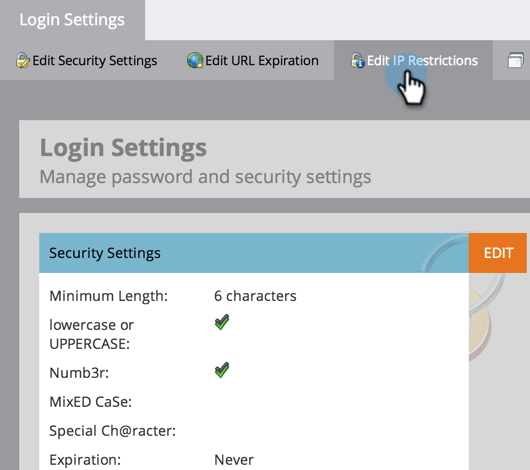

# 根據IP限制Marketo登入 {#restrict-marketo-logins-based-on-ip}

您可以根據使用者的IP位址來限制或允許使用者存取Marketo。 方法如下。

>[!NOTE]
>
>**需要管理員許可權**

>[!NOTE]
>
>本文資訊僅適用於login.marketo.com的直接登入。 目前無法對單一登入(SSO)登入執行IP限制。

1. 前往 **[!UICONTROL 管理員]** 區域。

   

1. 按一下 **[!UICONTROL 登入設定]**.

   

1. 按一下 **[!UICONTROL 編輯IP限制]**.

   

1. 選擇是否要 **允許** 或 **區塊** 指定地址，輸入地址，然後按一下 **[!UICONTROL 儲存]**.

   >[!NOTE]
   >
   >**定義**
   >
   >* **[!UICONTROL 允許的IP位址]**：新增允許的IP位址具有包容性。 它會包含指定的所有IP位址，並排除其他所有位址。
   >* **[!UICONTROL 封鎖網址]**：防止特定IP存取Marketo。
   >* **[!UICONTROL 停用IP限制]**：核取此項後將停止任何/所有限制規則運作。 將此用於測試目的。

   >[!NOTE]
   >
   >您可以新增多個限制，但這些限制只能是「全部允許」或「全部封鎖」。 您無法混搭允許和封鎖。

   

   做得不錯，您的行銷資料現在比以往更安全！
