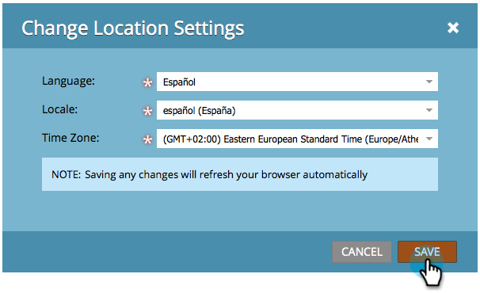

# 選取您的語言、地區設定和時區 {#select-your-language-locale-and-time-zone}

英文不是您的母語？ 別擔心，我們已為您解決問題。 以下說明如何變更Marketo Engage訂閱的語言、地區設定和時區。

>[!IMPORTANT]
>
>如果您的Marketo Engage訂閱已移轉至[具有Adobe識別碼](/help/marketo/product-docs/administration/marketo-with-adobe-identity/adobe-identity-management-overview.md){target="_blank"}的Marketo，則本文中只有[時區](#change-your-time-zone)適用於您。 若要變更您的語言和/或地區設定，這些設定必須在您的[Adobe帳戶設定檔](https://account.adobe.com/tw/profile){target="_blank"}中存取。

## 支援的語言 {#supported-languages}

* 英文
* 法文
* 德文
* 日文
* 葡萄牙文
* 西班牙文

## 變更使用者語言、地區設定和時區 {#change-user-language-locale-and-time-zone}

請依照下列步驟前往正確的區域，然後選擇要變更的設定。

1. 移至&#x200B;**[!UICONTROL 管理員]**&#x200B;區域。

   

1. 選取&#x200B;**[!UICONTROL 我的帳戶]**。

   

1. 在「我的帳戶」底下，按一下&#x200B;**[!UICONTROL 編輯位置設定]**。

   

### 變更您的語言 {#change-your-language}

1. 按一下&#x200B;**[!UICONTROL 語言]**&#x200B;下拉式清單，然後進行選取。

   

   >[!TIP]
   >
   >您也可以選擇按一下登入頁面頂端的語言下拉式清單，只變更您的語言。

### 變更您的地區設定 {#change-your-locale}

1. 按一下&#x200B;**[!UICONTROL 地區設定]**&#x200B;下拉式清單，然後進行選取。

   

### 變更您的時區 {#change-your-time-zone}

1. 按一下&#x200B;**[!UICONTROL 時區]**&#x200B;下拉式清單，並選取專案。

   

## 儲存 {#save}

1. 變更所需的設定後，只要按一下[儲存]。**&#x200B;**

   

完成了！您的瀏覽器將會重新整理，而且您應該會看到變更反映出來。
