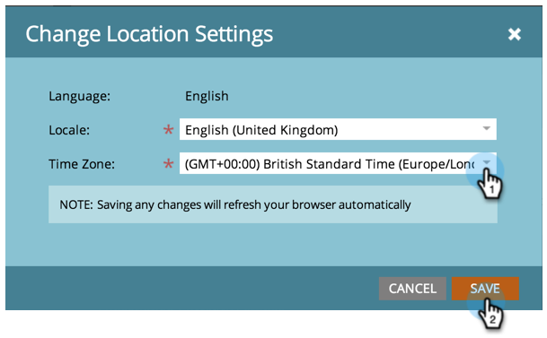

# 設定訂閱的預設位置設定 {#set-default-location-settings-for-a-subscription}

本文說明管理員如何檢視及編輯訂閱的預設位置設定，包括語言、地區設定和時區。

>[!NOTE]
>
>需要管理員許可權。 語言通常不是管理員會變更的內容。 它會在購買時指定，以便以適當的語言產生訂閱。

## 設定訂閱的預設位置設定 {#set-default-location-settings-for-a-subscription-1}

當管理員變更預設位置設定時，新建立的使用者會繼承這些設定。 使用者可以一律 [變更其語言、地區設定和時區偏好設定](/help/marketo/product-docs/administration/settings/select-your-language-locale-and-time-zone.md) 在其個別帳戶中。

1. 前往 **[!UICONTROL 管理員]** 區域。

   

1. 按一下 **[!UICONTROL 位置]**.

   

1. 按一下 **[!UICONTROL 編輯]**.

   

   此訂閱是以英文建立。 假設您住在倫敦，並且想要變更預設的地區設定和時區。 地區設定會決定數字、日期和時間的格式。

1. 選取 **[!UICONTROL 地區設定]** 並將其變更為 **[!UICONTROL 英文（英國）]**.

   

1. 最後，選擇適當的 **[!UICONTROL 時區]**.

   

   >[!NOTE]
   >
   >Marketo Sales Insight for [Salesforce.com](https://salesforce.com/) 支援法文、德文、日文、葡萄牙文和西班牙文。

## 設定訂閱的預設貨幣設定 {#set-the-default-currency-settings-for-a-subscription}

如果您要變更使用者的預設地區設定，您可能也想要變更貨幣格式設定。

1. 按一下 **[!UICONTROL 編輯]** 在 [!UICONTROL 訂閱貨幣設定].

   

1. 選取您選擇的貨幣格式，然後按一下 **[!UICONTROL 儲存]**.

   

   恭喜！您已變更訂閱的位置設定。

>[!MORELIKETHIS]
>
>* [選取您的語言、地區設定和時區](/help/marketo/product-docs/administration/settings/select-your-language-locale-and-time-zone.md)
