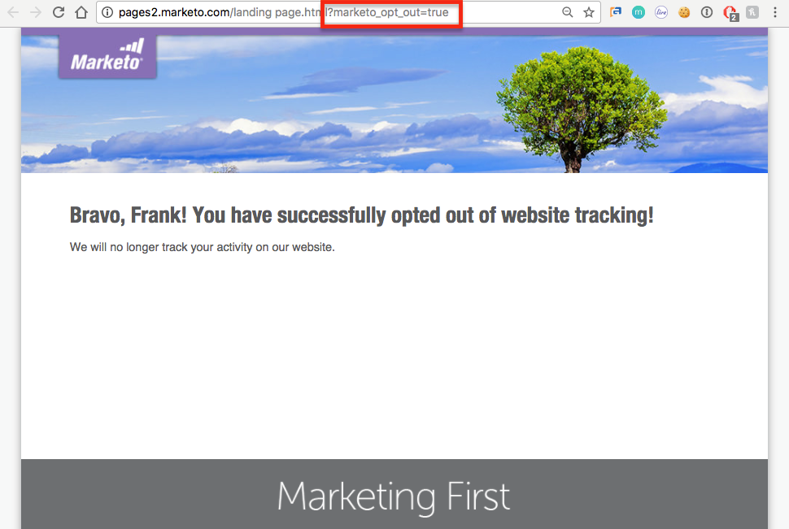

# 瞭解隱私權設定{#understanding-privacy-settings}

## 概述{#overview}

Marketo為行銷人員提供一種方式，讓網站訪客同意追蹤他們。 有兩種選擇退出的方式，或者您可以選擇由匿名IP追蹤。

* 網頁訪客在其瀏覽器中選取「不追蹤」(DNT)功能（行銷人員接受網頁訪客對「不追蹤」的要求）
* 網站訪客會使用網站上行銷人員提供的退出Cookie

或者，行銷人員可以追蹤使用者，但使用匿名IP。

這些方法可能會影響Marketo在特定領域的價值和功能。 不過，如果行銷人員&#x200B;*未*&#x200B;變更Marketo的設定，Marketo功能將維持不變。

## 不追蹤{#browser-settings-for-do-not-track}的瀏覽器設定

網頁訪客可設定其瀏覽器，以防止任何網站進行追蹤，方法是選擇「不追蹤」(DNT)。 這會防止追蹤此特定瀏覽器和裝置。 請參閱瀏覽器的隱私權設定，以取得完整的詳細資訊。

在Munchkin中，行銷人員可以[決定是否支援或忽略瀏覽器的DNT設定](/help/marketo/product-docs/administration/settings/edit-do-not-track-browser-support-settings.md)。

在「網頁個人化」中，行銷人員可決定是要[支援或忽略瀏覽器的DNT設定](/help/marketo/product-docs/web-personalization/getting-started/setting-web-personalization-to-do-not-track.md)。

## 選擇退出特定網站{#opt-out-from-a-specific-website}

您也可以允許網站訪客從您的網站選擇退出網站追蹤，不論是否設定了&#x200B;**瀏覽器不追蹤**&#x200B;設定。 這可讓網站訪客直接從您的網站指定其追蹤偏好設定。

若要這麼做，您必須在已啟用市政追蹤的網頁上新增參數至退出連結。 這可以是任何網頁，但網頁連結必須包含下列參數：

?marketo_opt_out=true

以下是具有退出連結的網頁範例，以及點按連結後的登陸頁面。 您的版本會有所不同。

這是一個網頁，其中有一個按鈕，在退出連結中加上&quot;?marketo_opt_out=true&quot;參數。

您可以建立並發佈著陸頁面，作為點按您具有&quot;?marketo_opt_out=true&quot;參數的連結時的後續頁面。

點按連結時，Marketo會將名為&#x200B;**mkto_opt_out**&#x200B;的Cookie新增至訪客的瀏覽器，以停用使用上述參數點按連結的網站訪客的Munchkin追蹤。

若要驗證Cookie是否可以植入，請確認您是Cookie銷售線索，然後按一下連結。 然後檢查您的瀏覽器Cookie，以確認已新增&#x200B;**mkto_opt_out** Cookie。

>[!NOTE]
>
>這目前僅適用於Munchkin 152及更新版本。

## 選擇加入{#opt-in}

行銷人員可讓使用者在電子郵件、表單、登陸頁面和其他方式中使用Marketo的功能來選擇加入。

## 使用匿名IP {#tracking-using-an-anonymized-ip}進行追蹤

行銷人員可以透過匿名IP位址追蹤使用者，以保留隱私權。 若要這麼做，請將此程式碼新增至內嵌在網站中的RTP或Munchkin Javascript。

* 對於Munchkin，只需將{&quot;annonyizeIP&quot;,true}新增至init函式即可。

   >[!NOTE]
   >
   >使用此參數需要啟用Munchkin V2。 若要啟用訂閱，請聯絡[行銷人員支援](https://nation.marketo.com/community/support_solutions)。

* 對於Web個人化(RTP)，請將此項新增至javascript:

`anonymize IP : before calling rtp('send','view'); add rtp('set', 'settings', {'anonymizeIP' : true});`
