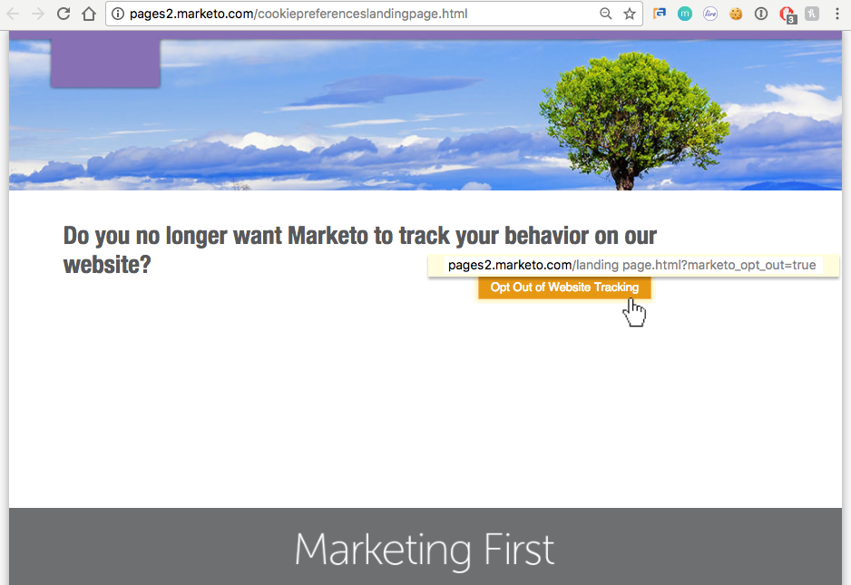

# 瞭解隱私權設定 {#understanding-privacy-settings}

## 概觀 {#overview}

Marketo為行銷人員提供了取得網頁訪客同意追蹤他們的方法。 有兩種方式選擇退出，或者您可以選擇由匿名化IP追蹤。

* 網站訪客在其瀏覽器中選取「不要追蹤」(DNT)功能（行銷人員會接受網站訪客的「不要追蹤」請求）
* 網站訪客使用行銷人員在網站上提供的選擇退出Cookie

或者，行銷人員可以追蹤使用者，但使用匿名化的IP。

這些方法可能會影響Marketo在特定區域中的價值和功能。 但是，如果行銷人員&#x200B;_沒有_&#x200B;變更Marketo設定中的任何專案，Marketo功能將維持不變。

## Do Not Track的瀏覽器設定 {#browser-settings-for-do-not-track}

網站訪客可以選擇「不要追蹤」(DNT)，設定瀏覽器以防止任何網站進行追蹤。 這會防止追蹤此特定瀏覽器和裝置。 如需完整詳細資料，請參閱瀏覽器的隱私權設定。

在[!DNL Munchkin]中，行銷人員可以[決定是否支援或忽略瀏覽器的DNT設定](/help/marketo/product-docs/administration/settings/edit-do-not-track-browser-support-settings.md)。

在Web Personalization中，行銷人員可以決定[支援還是忽略瀏覽器的DNT設定](/help/marketo/product-docs/web-personalization/getting-started/setting-web-personalization-to-do-not-track.md)。

## 選擇退出特定網站 {#opt-out-from-a-specific-website}

您也可以允許網站訪客從您的網站選擇退出網站追蹤，無論是否已設定&#x200B;**瀏覽器不要追蹤**&#x200B;設定。 這可讓網站訪客直接從您的網站指定其追蹤偏好設定。

若要這麼做，您必須在啟用[!DNL Munchkin]追蹤的網頁上，將引數新增至選擇退出連結。 這可以是任何網頁，但網頁連結必須包含以下引數：

？marketo_opt_out=true

以下是含有選擇退出連結的網頁範例，以及按一下連結後適用的登陸頁面。 您的會有所不同。

以下是網頁，其中包含在選擇退出連結中包含「？marketo_opt_out=true」引數的按鈕。

您可以建立並發佈登入頁面，作為您與「？marketo_opt_out=true」引數連結被點按時的後續追蹤頁面。

點按連結時，Marketo會將名稱為&#x200B;**mkto_opt_out**&#x200B;的Cookie新增至訪客的瀏覽器，以停用對使用上述引數點按連結的網站訪客的[!DNL Munchkin]追蹤。

若要驗證是否可以植入Cookie，請確認您是Cookie潛在客戶，然後按一下連結。 然後檢查您的瀏覽器Cookie，確認已新增&#x200B;**mkto_opt_out** Cookie。

>[!NOTE]
>
>目前僅適用於[!DNL Munchkin]版本152及更高版本。

## 選擇加入 {#opt-in}

行銷人員可在電子郵件、表單、登入頁面和其他方法中使用Marketo的功能，讓使用者選擇加入。

## 使用匿名化IP進行追蹤 {#tracking-using-an-anonymized-ip}

行銷人員可使用匿名化的IP位址追蹤使用者，以保留隱私權。 若要這麼做，請將此程式碼新增至網站內嵌的RTP或[!DNL Munchkin] Javascript。

* 若為[!DNL Munchkin]，只要將{&quot;anonymizeIP&quot;，true}新增至init函式。

  >[!NOTE]
  >
  >使用此引數需要啟用[!DNL Munchkin] V2。 若要為您的訂閱啟用此功能，請連絡[Marketo支援](https://nation.marketo.com/community/support_solutions)。

* 針對Web Personalization (RTP)，請將此專案新增至Javascript：

`anonymize IP : before calling rtp('send','view'); add rtp('set', 'settings', {'anonymizeIP' : true});`
