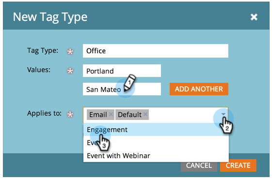

# 建立新程式標籤和標籤值 {#create-a-new-program-tag-and-tag-values}

>[!NOTE]
>
>**需要管理權限**

您可以建立自訂 [標籤](/help/marketo/product-docs/core-marketo-concepts/programs/working-with-programs/understanding-tags.md) ，並將值指派給標籤。

>[!NOTE]
>
>**範例**
>
>程式標籤：目標對象
>
>程式標籤值：中小型企業、企業、中端市場

1. 前往 **管理** 的上界。

   

1. 按一下 **標籤**.

   

1. 按一下 **新增** 選取 **新標籤類型**.

   

1. 輸入 **標籤類型** 和標籤 **值**. 然後按一下 **新增其他**.

   

1. 輸入您需要的值。 選取要將此標籤套用到的方案類型。

   

   >[!TIP]
   >
   >可以選擇多個程式類型。 進行新程式時，此標籤類型將可供使用。

1. 檢查 **必填** 按一下 **建立**.

   

   >[!NOTE]
   >
   >如果標籤類型為 **必填**，則使用者在建立新方案時必須輸入標籤的值。

   

現在，當您的使用者建立方案時，他們必須為已建立的標籤設定自訂值。
