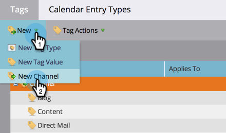
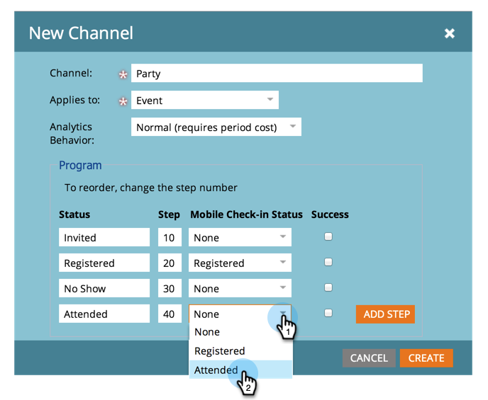
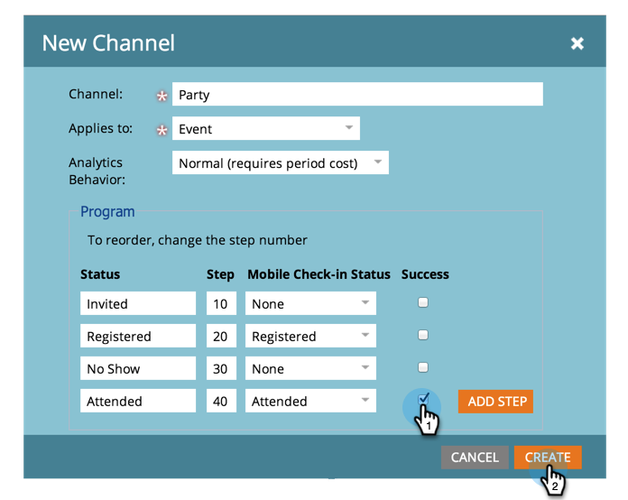

# 建立方案頻道 {#create-a-program-channel}

計畫是一種特定的行銷計畫。 此管道旨在作為傳遞機制，例如網路研討會、贊助或線上廣告。

>[!NOTE]
>
>**需要管理員許可權**

>[!NOTE]
>
>進一步瞭解 [計畫](/help/marketo/product-docs/core-marketo-concepts/programs/creating-programs/understanding-programs.md)是Marketo中最重要的元素。

1. 前往 **[!UICONTROL 管理員]** 區域。

   

1. 按一下 **[!UICONTROL 標籤]**.

   

   >[!NOTE]
   >
   >為何標籤？ 管道是描述節目的一種方式，就像其他標籤一樣。 此頻道僅提供特殊的額外功能。

1. 按一下 **+** 在「 」旁簽名 [!UICONTROL 頻道] 以展開並檢視現有管道。

   

1. 下 **[!UICONTROL 新增]**，按一下 **[!UICONTROL 新增頻道]**.

   

   >[!NOTE]
   >
   >**範例**
   >
   >頻道：廣告牌
   >
   >* 套用至：預設
   >* 進度：成員、參與（如有疑問，這些工作正常）
   >* 成功：參與
   >
   >管道：合作對象
   >
   >* 套用至：事件
   >* 進度：已邀請、已註冊、無節目和已出席
   >* 成功：已出席
   >
   >檢視現有管道的進度，瞭解如何使用它們。

1. 以派對頻道為例。 為您的新專案命名 **頻道** 並選取要套用的程式型別。

   

   >[!NOTE]
   >
   >套用至什麼？ 有數種型別的計畫。 將頻道與正確的型別配對。 如有疑問，請選擇 **[!UICONTROL 預設]**.

   >[!NOTE]
   >
   >使用&quot;[!UICONTROL 網路研討會活動]「 」系統對應將會鎖定（根據網路研討會整合的要求）且無法編輯。

1. 輸入前兩個程式狀態名稱，然後按一下 **[!UICONTROL 新增步驟]**.

   

1. 輸入其他計畫 **[!UICONTROL 狀態]** 和 **[!UICONTROL 步驟]** 數字，然後按一下 **[!UICONTROL 新增步驟]**.

   

   >[!TIP]
   >
   >此 **[!UICONTROL 步驟]** 編號用於排序程式狀態。 請記住，人們不能在這些漸進步驟中後退。 他們只能將狀態變更為更高或相等的值狀態。 當狀態要來回切換而不是進度時，請使用相等值。

1. 輸入最後一個程式 **[!UICONTROL 狀態]** 和 **[!UICONTROL 步驟]** 數字。

   

   >[!NOTE]
   >
   >使用型別&quot;[!UICONTROL 事件]，」需要系統對應至「已註冊」、「輪候」和「已參加」狀態。 因此，這些狀態無法隱藏。

1. 選取 **[!UICONTROL 行動簽到狀態]** 的 **[!UICONTROL 已註冊]**.

   

1. 選取 **[!UICONTROL 行動簽到狀態]** 的 **[!UICONTROL 已出席]**.

   

   >[!NOTE]
   >
   >**[!UICONTROL 行動簽到狀態]** 只有在頻道將用於事件計畫時，選項才可用。

   >[!NOTE]
   >
   >僅限擁有下列身分的人員： **[!UICONTROL 行動簽到狀態]** 之 **[!UICONTROL 已註冊]** 和 **[!UICONTROL 已出席]** 將顯示在 [行動簽入應用程式](/help/marketo/product-docs/core-marketo-concepts/mobile-apps/event-check-in/event-check-in-overview.md).

   >[!TIP]
   >
   >如果在行動簽入應用程式中建立新人員，事件程式中會將其設為「已註冊」。 如果有人在應用程式上簽入事件，事件程式中的該人會設定為已參加。

1. 選取 **[!UICONTROL 成功]** 程式狀態，然後按一下 **[!UICONTROL 建立]**.

   

   幹得漂亮！ 當您製作該型別的新節目時，此新頻道將是選項之一。
