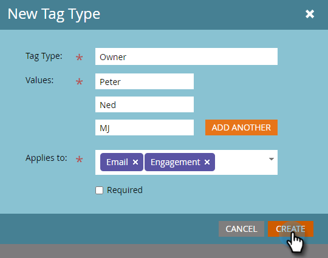

# 建立自訂標籤 {#create-custom-tags}

標籤可協助您組織方案，而管道則可協助收集資料以用於報表用途。

>[!NOTE]
>
>結帳 [了解標籤](/help/marketo/product-docs/core-marketo-concepts/programs/working-with-programs/understanding-tags.md) 以取得更多資訊。

>[!NOTE]
>
>**需要管理權限**

## 建立新的標籤類型 {#create-a-new-tag-type}

要建立新標籤類型：

1. 前往 **管理** 區段。

   

1. 按一下 **標籤**.

   

1. 按一下 **新增** 選取 **新標籤類型。**

   

1. 輸入標籤類型的名稱。

   

1. 為「標籤類型」輸入所需的值。 按一下 **新增其他** 以輸入其他值。

   

1. 選擇此標籤應用的程式類型。

   

1. 決定是否將此標籤設為所列所有方案類型的必要標籤。

   

   >[!NOTE]
   >
   >* 如果您想在每次建立新程式時新增此標籤，請選取「必要」。
   >* 從「應用於」清單中刪除程式類型將從該類型的所有現有程式中刪除標籤及其值。 如果您想保留現有的標籤值，並將此標籤設為可選項目，以便 _all_ 列出方案類型，保留「必要」核取方塊未選取。

   >[!TIP]
   >
   >如果您想要讓某些方案類型需要類似的標籤，但其他方案則需要選用，則需要設定兩個不同的標籤，每個標籤都應用於不同的方案類型，其中一個方案類型已選中「必要」，而另一個方案類型未選中「必要」。

1. 按一下 **建立**。

   
