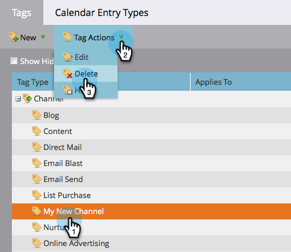

# 刪除節目頻道 {#delete-a-program-channel}

方案管道是方案中應經過的狀態或查核點銷售機會的集合。

如果您意外或不再需要，則可將其刪除。

1. 前往 **管理** 的上界。

   

1. 按一下 **標籤**.

   

1. 選取您要刪除的管道，在「標籤動作」下方按一下「刪除」。

   >[!TIP]
   >
   >如果管道與任何程式相關聯，則不能刪除，只能隱藏。

   

砰！ 您也可以 [從通道中刪除特定狀態](/help/marketo/product-docs/administration/tags/delete-a-program-status-from-a-program-channel.md).
