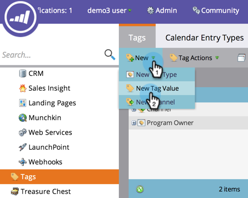

# 管理標籤值{#managing-tag-values}

[標](/help/marketo/product-docs/core-marketo-concepts/programs/working-with-programs/understanding-tags.md) 語用於描述程式。您可以視需要製作任意數量的影像，每個影像都具有獨特的值。 以下是如何管理這些價值觀。

>[!NOTE]
>
>**需要管理員權限**

>[!PREREQUISITES]
>
>[建立新的程式標籤和標籤值](/help/marketo/product-docs/administration/tags/create-a-new-program-tag-and-tag-values.md)

## 添加標籤值{#adding-tag-values}

1. 在&#x200B;**Admin**&#x200B;下，按一下&#x200B;**Tags**。

   

1. 按一下「**新增**」，然後按一下「新增標籤值&#x200B;**」。**

   

1. 選擇&#x200B;**標籤類型**。

   

1. 輸入&#x200B;**值**，然後按一下&#x200B;**添加其他**。 您可以視需要新增任何值。

   

1. 添加其餘值，然後按一下&#x200B;**建立**。

   

1. 您應立即看到變更！

   

## 隱藏標籤值{#hiding-tag-values}

舊程式可能會使用標籤。 您可以隱藏標籤類型來取代這些標籤，以供日後使用。

1. 選擇&#x200B;**Tag**&#x200B;並選擇要隱藏的&#x200B;**Value**。

   

1. 在&#x200B;**標籤操作**&#x200B;下，選擇&#x200B;**隱藏**。

   

## 顯示隱藏值{#show-hidden-values}

如果您想要再次查看隱藏值，請執行下列動作：

1. 選擇「顯示隱藏」框。 勾選後，您就可以看到隱藏值。

   

然後，您就可以取消隱藏您日後要使用的值。
