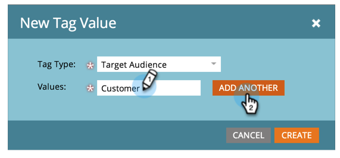
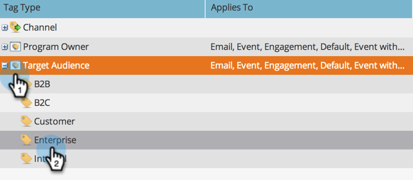

# 管理標籤值 {#managing-tag-values}

[標籤](/help/marketo/product-docs/core-marketo-concepts/programs/working-with-programs/understanding-tags.md) 用於說明程式。 您可以視需要製作多個元件，每個元件都有唯一值。 以下說明如何管理這些值。

>[!NOTE]
>
>**需要管理員許可權**

>[!PREREQUISITES]
>
>[建立新的程式標籤和標籤值](/help/marketo/product-docs/administration/tags/create-a-new-program-tag-and-tag-values.md)

## 新增標籤值 {#adding-tag-values}

1. 前往 **[!UICONTROL 管理員]** 區域。

   

1. 按一下 **[!UICONTROL 標籤]**.

   

1. 按一下 **[!UICONTROL 新增]**，則 **[!UICONTROL 新標籤值]**.

   

1. 選取 **[!UICONTROL 標籤型別]**.

   

1. 輸入 **[!UICONTROL 值]** 並按一下 **[!UICONTROL 新增其他]**. 您可以新增任意數量的值。

   

1. 新增其餘值並按一下 **[!UICONTROL 建立]**.

   

您應該會立即看到變更！

## 隱藏標籤值 {#hiding-tag-values}

標籤可能被舊程式使用。 您可以藉由隱藏標籤型別來取代它們，以供日後使用。

1. 選取 **[!UICONTROL 標籤]** 並選取 **[!UICONTROL 值]** 您想要隱藏。

   

1. 下 **[!UICONTROL 標籤動作]**，選取 **[!UICONTROL 隱藏]**.

   

## 顯示隱藏值 {#show-hidden-values}

如果您想要再次檢視隱藏值，請執行下列動作：

1. 選取 **[!UICONTROL 顯示隱藏專案]** 核取方塊。 檢查完畢後，即可看到隱藏值。

   

然後，您可以取消隱藏要用於未來的值。
