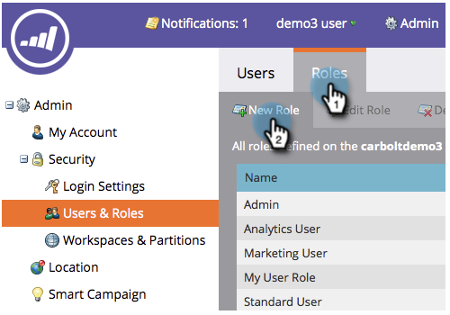

# 僅建立API使用者角色 {#create-an-api-only-user-role}

如果您想透過[REST API](https://developers.marketo.com/documentation/rest/)與Marketo整合，最佳作法是[將API僅角色](/help/marketo/product-docs/administration/users-and-roles/create-an-api-only-user.md)指派給使用者，然後[建立自訂服務以便與ReST API](/help/marketo/product-docs/administration/additional-integrations/create-a-custom-service-for-use-with-rest-api.md)搭配使用。 以下說明如何建立僅限API的使用者角色。

>[!NOTE]
>
>**需要管理權限**

1. 在「我的Marketo」中，按一下&#x200B;**管理**。

   

1. 在「安全性」下，按一下「**用戶和角色**」。

   

1. 按一下&#x200B;**角色**&#x200B;標籤，然後按一下&#x200B;**新角色**。

   

1. 輸入角色名稱，選擇要授予的API訪問權限，然後按一下「**建立」。**

   

>[!TIP]
>
>只授予所需的最低權限總是不錯的主意。

>[!MORELIKETHIS]
>
>好了，幹得好！ 現在，讓我們[建立僅限API使用者](/help/marketo/product-docs/administration/users-and-roles/create-an-api-only-user.md)。
