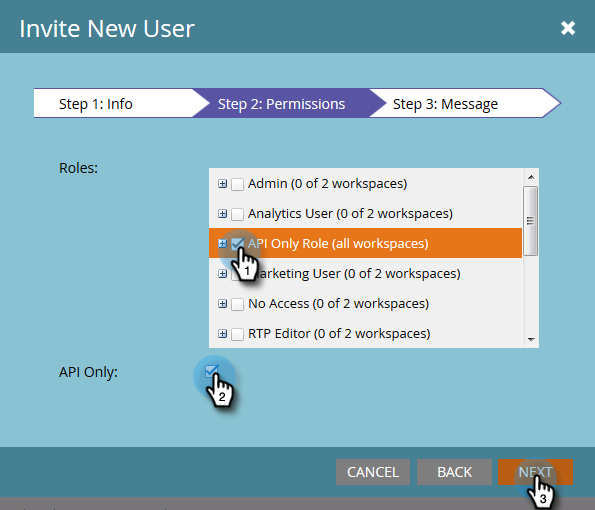

# 建立僅 API 使用者 {#create-an-api-only-user}

如果您想要透過[REST API](https://experienceleague.adobe.com/zh-hant/docs/marketo-developer/marketo/rest/rest-api){target="_blank"}與Marketo整合，您將需要建立「僅限API使用者」。 方法如下。

>[!IMPORTANT]
>
>如果您在已上線至Adobe Identity的訂閱中建立「僅限API使用者」，則您的步驟會不同，您可在此處[找到](/help/marketo/product-docs/administration/marketo-with-adobe-identity/add-api-only-user-for-adobe-ims-enabled-subscriptions.md){target="_blank"}。

>[!PREREQUISITES]
>
>[建立僅限API的使用者角色](/help/marketo/product-docs/administration/users-and-roles/create-an-api-only-user-role.md){target="_blank"}

>[!NOTE]
>
>**需要管理員許可權**

1. 前往「**[!UICONTROL Admin]**」區域。

   

1. 按一下「**[!UICONTROL Users & Roles]**」。

   

1. 按一下「**[!UICONTROL Invite New User]**」。

   

1. 輸入API使用者的電子郵件、名字和姓氏。 按一下「**[!UICONTROL Next]**」。

   

   >[!TIP]
   >
   >新增選用的[!UICONTROL Reason]或[!UICONTROL Access Expiration]日期。 短期員工的存取權到期日很方便。

1. 選取&#x200B;**[!UICONTROL API Only]**&#x200B;角色並勾選&#x200B;**[!UICONTROL API Only]**&#x200B;核取方塊。 按一下「**[!UICONTROL Next]**」。

   

1. 按一下「**[!UICONTROL Send]**」。

   

>[!NOTE]
>
>快顯視窗會顯示「不只要求API提供邀請」，但並不表示您做了錯誤的事情。 這表示我們將建立角色，而不需傳送邀請電子郵件。

那就好！ 現在，讓我們開始建立自訂服務。

>[!MORELIKETHIS]
>
>[建立自訂服務以搭配REST API使用](/help/marketo/product-docs/administration/additional-integrations/create-a-custom-service-for-use-with-rest-api.md){target="_blank"}
