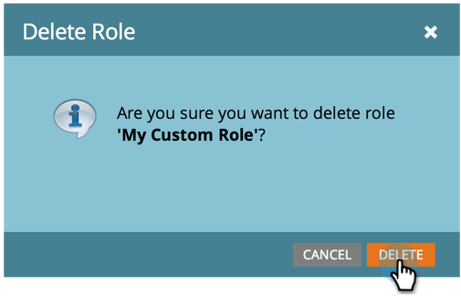

# 建立、刪除、編輯和變更使用者角色 {#create-delete-edit-and-change-a-user-role}

**角色** 將多個許可權分組。 **許可權** 可讓您在Marketo中執行操作。 您指派 **角色** 至使用者。 象圓形圖一樣簡單。

>[!NOTE]
>
>**需要管理員許可權**

>[!IMPORTANT]
>
>下列角色是系統角色，無法編輯或刪除：
>
>* 管理員
>* Adobe產品管理員
>* 標準使用者
>* RTP編輯器
>* RTP啟動器

## 建立角色 {#create-a-role}

1. 前往 **[!UICONTROL 管理員]** 區域。

   

1. 按一下 **[!UICONTROL 使用者和角色]**.

   

1. 前往 **[!UICONTROL 角色]** 標籤並按一下 **[!UICONTROL 新角色]**.

   

1. 為新的角色命名，並核取您要授予與該角色相關聯之使用者的所有許可權，然後按一下 **[!UICONTROL 建立]**.

   

## 刪除角色 {#delete-a-role}

1. 前往 **[!UICONTROL 管理員]** 區域。

   

1. 按一下 **[!UICONTROL 使用者和角色]**.

   

1. 在 **[!UICONTROL 角色]** 索引標籤中，選取角色並按一下 **[!UICONTROL 刪除角色]**.

   

1. 按一下以確認刪除 **[!UICONTROL 刪除]**.

   

>[!NOTE]
>
>您必須先確定沒有使用者指派給角色，否則無法刪除角色。

## 編輯現有角色 {#edit-an-existing-role}

>[!NOTE]
>
>若要編輯您自己的使用者角色，您必須以其他具有管理員許可權的使用者身分登入。

1. 前往 **[!UICONTROL 管理員]** 區域。

   

1. 按一下 **[!UICONTROL 使用者和角色]**.

   

1. 按一下 **[!UICONTROL 角色]** 標籤。

   

1. 選取您要編輯的角色並按一下 **[!UICONTROL 編輯角色]**.

   

1. 進行所有需要的變更，然後按一下 **[!UICONTROL 儲存]**.

   

   >[!NOTE]
   >
   >對角色所做的變更將會影響與此角色相關聯的每個使用者。

   >[!TIP]
   >
   >您是否要更新帳戶電子郵件地址？ [在此處瞭解如何操作](/help/marketo/product-docs/administration/settings/edit-account-settings.md).

## 變更使用者的角色 {#change-a-users-role}

1. 前往 **[!UICONTROL 管理員]** 區域。

   

1. 按一下 **[!UICONTROL 使用者和角色]**.

   

1. 選取您要指派不同角色的使用者，然後按一下 **[!UICONTROL 編輯使用者]**.

   

1. 取消核取上一個角色，選取新角色，然後按一下 **[!UICONTROL 儲存]**.

   

>[!NOTE]
>
>如果您保留選取的多個角色，Marketo預設會具有最嚴格的許可權。
