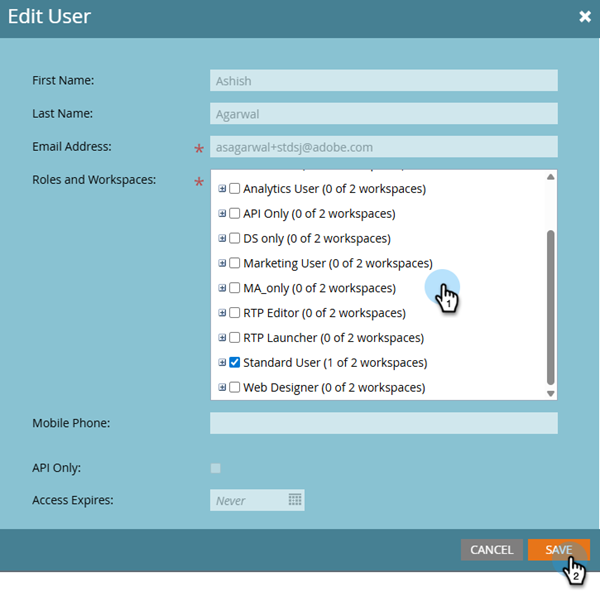

# 編輯使用者工作區 {#edit-user-workspaces}

1. 前往「**[!UICONTROL Admin]**」區域。

   

1. 按一下「**[!UICONTROL Users & Roles]**」。

   

1. 選取想要的使用者並按一下&#x200B;**[!UICONTROL Edit User]**。

   

1. 進行您想要的變更，然後按一下&#x200B;**[!UICONTROL Save]**。

   
