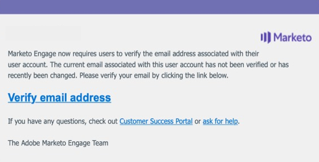

# 電子郵件驗證 {#email-verification}

Adobe Marketo Engage訂閱需要所有非API的使用者(包括Marketo Engage管理員)驗證其電子郵件地址。 未指派管理員角色或已指派具有「略過SSO」許可權之角色的Single Sign-on (SSO)使用者，在透過電子郵件驗證功能啟用其訂閱時，將會自動驗證其電子郵件。

## 使用者邀請 {#user-invite}

當管理員邀請使用者時，該使用者在按一下邀請連結後就會自動驗證。 系統會自動驗證未指派管理員角色的SSO使用者。

## 驗證電子郵件 {#verification-email}

當訂閱的電子郵件驗證已啟動，或是管理員/使用者觸發時，使用者會收到以下電子郵件：

>[!NOTE]
>
>若要將驗證電子郵件重新傳送給未驗證的使用者，只要選取其記錄並按一下 **驗證電子郵件** 按鈕。

## 變更電子郵件地址 {#changing-an-email-address}

當使用者的電子郵件地址變更時，它將變為未驗證。 系統會傳送電子郵件給他們，讓他們重新驗證。 使用者可以按一下「 」，手動重新傳送該電子郵件 **重新傳送驗證**.

## 使用者和角色 {#users-and-roles}

在 **管理員** > **使用者和角色**，電子郵件狀態列會顯示每個使用者的驗證狀態。

## 多個使用者登入ID {#multiple-user-login-ids}

一個電子郵件地址只能關聯一個使用者帳戶。 如果有多個使用者帳戶與單一電子郵件地址相關聯，則Marketo Engage需要解決衝突，並顯示與電子郵件地址相關聯的所有使用者登入，以及三個解決方法選項：

* 使用目前的電子郵件作為目前的使用者登入ID
* 使用新電子郵件作為目前的使用者登入ID
* 延遲決定至下一次登入

   

>[!NOTE]
>
>雖然使用者帳戶必須與單一地址相關聯，但使用者帳戶可透過通用ID用於許多訂閱。
