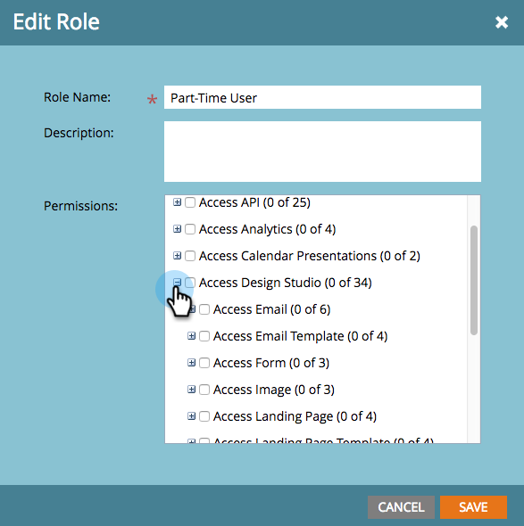

# 啟用程式碼片段的不草稿 {#enable-no-draft-for-snippets}

程式碼片段免草稿可讓您發佈程式碼片段變更，而不需草擬經核准的資產。 所有使用已編輯程式碼片段的資產都會取得更新並維持其個別狀態：

* 核准的資產會取得程式碼片段更新並保持核准

* 草稿會取得程式碼片段更新，並維持在草稿模式

所有管理員角色都會自動啟用「無草稿」。 然後，管理員可以為任何其他角色啟用此功能。

>[!NOTE]
>
>**需要管理員許可權**

1. 前往 **[!UICONTROL 管理員]** 區域。

   

1. 按一下 **[!UICONTROL 使用者和角色]**.

   

1. 前往 **[!UICONTROL 角色]** 標籤，選取角色，然後按一下 **[!UICONTROL 編輯角色]**.

   

1. 展開 **[!UICONTROL 存取Design Studio]** 選項。

   

1. 展開 **[!UICONTROL 存取代碼片段]** 選項。

   

1. 展開 **[!UICONTROL 核准程式碼片段]** 許可權並檢查 **[!UICONTROL 無草稿]** 方塊。 然後按一下 **[!UICONTROL 儲存]**.

   

>[!TIP]
>
>若要停用「不拔模」，請依照上述步驟1-4操作，清除「不拔模」核取方塊，然後按一下 **[!UICONTROL 儲存]**.

>[!MORELIKETHIS]
>
>[核准無草稿的程式碼片段](/help/marketo/product-docs/personalization/segmentation-and-snippets/snippets/approve-a-snippet-with-no-draft.md){target="_blank"}
