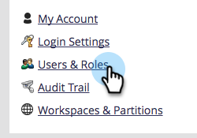

# 啟用程式碼片段無草稿 {#enable-no-draft-for-snippets}

程式碼片段免草稿可讓您發佈程式碼片段變更，而不需草擬經核准的資產。 所有使用已編輯程式碼片段的資產都會取得更新並維持其個別狀態：

* 核准的資產會取得程式碼片段更新並保持核准

* 草稿會取得程式碼片段更新，並維持在草稿模式

所有管理員角色都會自動啟用「無草稿」。 然後，管理員可以為任何其他角色啟用此功能。

>[!NOTE]
>
>**需要管理員許可權**

1. 前往「**[!UICONTROL Admin]**」區域。

   

1. 按一下「**[!UICONTROL Users & Roles]**」。

   

1. 移至&#x200B;**[!UICONTROL Roles]**&#x200B;標籤，選取角色，然後按一下&#x200B;**[!UICONTROL Edit Role]**。

   

1. 展開&#x200B;**[!UICONTROL Access Design Studio]**&#x200B;選項。

   

1. 展開&#x200B;**[!UICONTROL Access Snippet]**&#x200B;選項。

   

1. 展開&#x200B;**[!UICONTROL Approve Snippet]**&#x200B;許可權並勾選&#x200B;**[!UICONTROL No-Draft]**&#x200B;方塊。 然後按一下「**[!UICONTROL Save]**」。

   

>[!TIP]
>
>若要停用「不草稿」，請依照上述步驟1-4，清除「不草稿」核取方塊，然後按一下&#x200B;**[!UICONTROL Save]**。

>[!MORELIKETHIS]
>
>[核准無草稿的程式碼片段](/help/marketo/product-docs/personalization/segmentation-and-snippets/snippets/approve-a-snippet-with-no-draft.md){target="_blank"}
