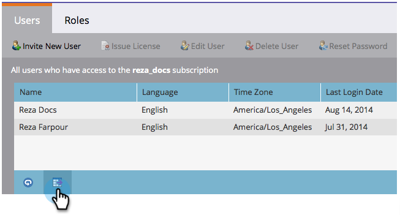

# 導出用戶和角色清單{#export-a-list-of-users-and-roles}

>[!NOTE]
>
>**需要管理員權限**

匯出使用者和使用者角色的完整清單相當簡單。 這是方法。

1. 前往&#x200B;**Admin**。

   

1. 按一下「**用戶和角色**」。

   

1. 在匯出之前，新增／移除您想要的任何欄。

   >[!TIP]
   >
   >要導出角色，請先轉到&#x200B;**角色**** **頁籤，然後導出。

   

1. 按一下&#x200B;**導出**&#x200B;表徵圖。

   

   就這些！ 您應下載新的Excel檔案。

   
