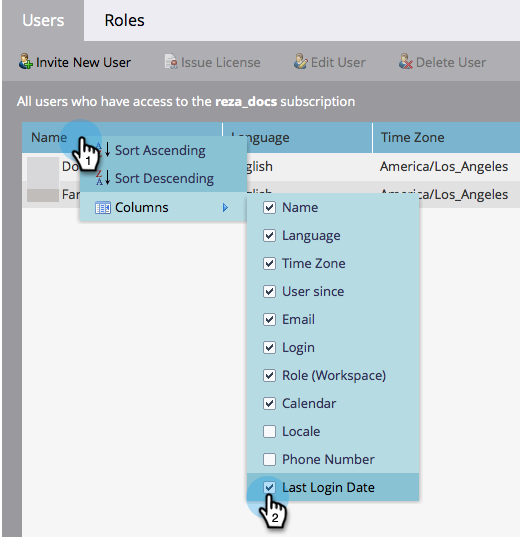

# 匯出使用者和角色清單 {#export-a-list-of-users-and-roles}

>[!NOTE]
>
>**需要管理員權限**

匯出使用者和使用者角色的完整清單相當容易。 方法如下。

1. 前往 **[!UICONTROL Admin]**。

   

1. 按一下「**[!UICONTROL Users & Roles]**」。

   

1. 匯出之前，新增/移除任何您想要的欄。

   >[!TIP]
   >
   >若要匯出角色，請先移至&#x200B;**[!UICONTROL Roles]**&#x200B;標籤，然後匯出。

   

1. 按一下&#x200B;**[!UICONTROL Export]**&#x200B;圖示。

   

   僅此而已，大家！ 您應該要下載新的Excel檔案。

   
