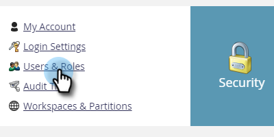

# 導出角色和權限{#export-roles-and-permissions}

以下說明如何匯出所有角色及其權限。

>[!NOTE]
>
>需要管理員權限

1. 在我的行銷工具中，按一下&#x200B;**管理**。

   

1. 選擇&#x200B;**用戶和角色**。

   

1. 按一下&#x200B;**角色**&#x200B;頁籤。

   

1. 捲動至頁面底部，然後按一下「匯出」按鈕。

   

>[!NOTE]
>
>請確定您的瀏覽器未封鎖來自Marketo的快顯視窗。

資料會匯出為CSV，並包含角色、權限和每個群組已啟用多少權限的計數。

