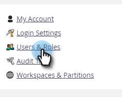

# 管理Marketo使用者 {#managing-marketo-users}

## 建立使用者 {#create-users}

1. 前往 **[!UICONTROL 管理員]** 區域。

   

1. 按一下 **[!UICONTROL 使用者和角色]**.

   

1. 按一下 **[!UICONTROL 邀請新使用者]**.

   

1. 輸入 **[!UICONTROL 電子郵件]**， **[!UICONTROL 名字]**、和 **[!UICONTROL 姓氏]**.

   

1. 選擇性地輸入邀請原因，並在 **[!UICONTROL 存取權過期]** 使用日期選擇器的欄位。

   

1. 按一下 **[!UICONTROL 下一個]**.

   

   >[!TIP]
   >
   >到期日非常適合短期的外部利害關係人或顧問，因為他們只需要在短時間記憶體取Marketo。

   >[!NOTE]
   >
   >到期日到達時，使用者會收到到期通知，且他們的帳戶會遭鎖定。

1. 選取 **[!UICONTROL 角色]** ，然後按一下 **[!UICONTROL 下一個]**.

   

1. 如有需要，請編輯邀請訊息。 按一下 **Send**.

   

   >[!NOTE]
   >
   >電子郵件/登入必須是唯一的；如果您已在沙箱執行個體中使用它，則需要在生產中使用不同的沙箱，反之亦然。

   

   >[!NOTE]
   >
   >邀請會在新增新使用者後三天到期。

新使用者現在列在使用者索引標籤中，並將收到一封電子郵件，其中包含如何啟用其帳戶的指示。

## 刪除使用者 {#delete-users}

1. 前往 **[!UICONTROL 管理員]** 區域。

   

1. 按一下 **[!UICONTROL 使用者和角色]**.

   

1. 選取您要移除的使用者，然後按一下 **[!UICONTROL 刪除使用者]**.

   

1. 按一下以確認 **[!UICONTROL 確定]**.

   

## 重設使用者密碼 {#reset-user-passwords}

1. 前往 **[!UICONTROL 管理員]** 區域。

   

1. 按一下 **[!UICONTROL 使用者和角色]**.

   

1. 選取使用者並按一下 **[!UICONTROL 重設密碼]**.

   

1. 按一下 **[!UICONTROL 關閉]** 關閉提示。

   

使用者將收到一封包含密碼重設指示的電子郵件。

>[!TIP]
>
>如果使用者在收件匣中看不到電子郵件，請要求他們檢查其垃圾郵件/垃圾郵件資料夾。

## 變更許可權與編輯使用者資訊 {#change-permissions-and-edit-user-information}

1. 前往 **[!UICONTROL 管理員]** 區域。

   

1. 按一下 **[!UICONTROL 使用者和角色]**.

   

1. 選取使用者並按一下 **[!UICONTROL 編輯使用者]**.

   

1. 您可以編輯使用者資訊並變更關聯的角色。 按一下 **[!UICONTROL 儲存]**.

   

>[!CAUTION]
>
>如果您是Marketo的唯一管理員，請務必不要移除自己的管理員許可權。

>[!NOTE]
>
>如果邀請新使用者擔任管理員，或刪除管理員，則所有目前管理員都會收到電子郵件通知。

做得很棒！ 您現在知道如何建立使用者、刪除使用者、重設使用者密碼以及編輯使用者。
