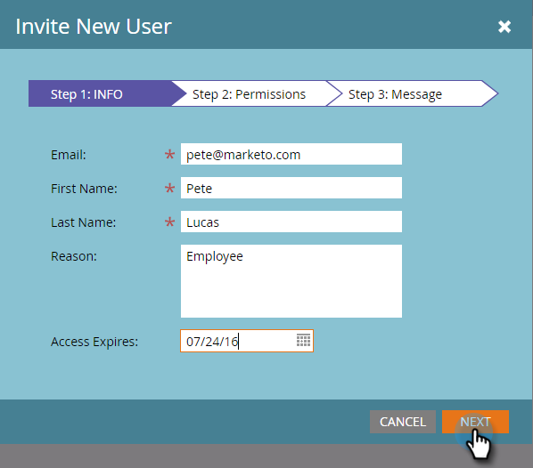

# 管理Marketo使用者 {#managing-marketo-users}

## 建立使用者 {#create-users}

1. 前往 **管理** 的上界。

   

1. 按一下 **使用者與角色**.

   

1. 按一下 **邀請新用戶**.

   

1. 輸入 **電子郵件地址**, **名字**，和 **姓氏**.

   

1. （可選）輸入邀請的原因，並在 **存取過期** 欄位。

   

1. 按一下 **下一個**.

   

   >[!TIP]
   >
   >到期日非常適合只需短暫存取Marketo的短期外部利害關係人或顧問。

   >[!NOTE]
   >
   >到達到期日時，使用者會收到到期通知，且其帳戶已鎖定。

1. 選取 **角色** 按一下 **下一個**.

   

1. 視需要編輯邀請訊息。 按一下 **傳送**.

   

   >[!NOTE]
   >
   >電子郵件/登入必須是唯一的；如果您已在沙箱例項中使用過，則需要在生產環境中使用不同的例項，反之亦然。

   

   >[!NOTE]
   >
   >邀請在新增使用者後三天過期。

新使用者現在會列在「使用者」索引標籤中，並會收到電子郵件，內含如何啟用其帳戶的指示。

## 刪除使用者 {#delete-users}

1. 前往 **管理** 的上界。

   

1. 按一下 **使用者與角色**.

   

1. 選擇要刪除的用戶，然後按一下 **刪除用戶**.

   

1. 按一下以確認 **確定**.

   

## 重置用戶密碼 {#reset-user-passwords}

1. 前往「管理員」區域。

   

1. 按一下 **使用者與角色**.

   

1. 選取使用者，然後按一下 **重設密碼**.

   

1. 按一下 **關閉** 關閉提示。

   

使用者會收到包含密碼重設指示的電子郵件。

>[!TIP]
>
>如果使用者的收件匣中未顯示電子郵件，請要求他們檢查其垃圾郵件/垃圾郵件資料夾。

## 變更權限和編輯使用者資訊 {#change-permissions-and-edit-user-information}

1. 前往 **管理** 的上界。

   

1. 按一下 **使用者與角色**.

   

1. 選取使用者，然後按一下 **編輯用戶**.

   

1. 您可以編輯用戶資訊並更改相關角色。 按一下 **儲存**.

   

>[!CAUTION]
>
>如果您是Marketo中唯一的管理員，請務必不要移除自己的管理權限。

>[!NOTE]
>
>如果邀請新使用者擔任管理員，或刪除管理員，所有目前的管理員都會收到電子郵件通知。

太棒了！ 您現在知道如何建立使用者、刪除使用者、重設使用者密碼及編輯使用者。
