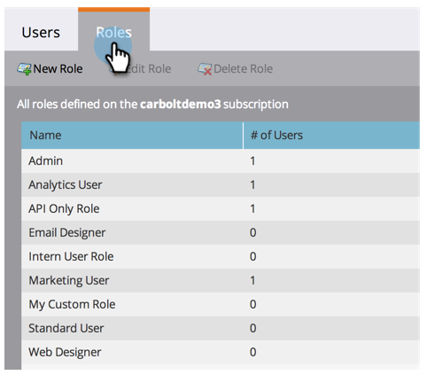

# 管理使用者角色和權限 {#managing-user-roles-and-permissions}

設定、建立和編輯使用者角色，並將其指派給使用者。 這可讓您控制每個Marketo使用者都可存取的區域和功能。

例如，行銷使用者通常需要跨應用程式的廣泛存取權，才能建立、修改和部署電子郵件、登錄頁面和程式。 另一方面，網頁設計人員幾乎所有時間都在Design Studio中，建立資產以用於電子郵件和登錄頁面。 雖然公司領導人在Analytics領域廣泛使用Marketo的報表，但他們可能不需要自行建立或驅動資產或程式。

>[!NOTE]
>
>**需要管理權限**

Marketo提供數種內建角色，具有不同的存取層級：

* **管理**  — 應用程式的所有部分，包括「管理員」部分
* **標準使用者**  — 應用程式的所有部分，「管理員」部分除外
* **行銷使用者**  — 應用程式的所有部分，「管理員」部分除外
* **網頁設計工具**  — 僅Design Studio
* **Analytics使用者**  — 僅限Analytics區段

您無法編輯管理員和標準使用者角色，但可以編輯其他角色。 您也可以建立新的自訂角色，以符合您公司中的特定組織結構。

## Marketo與Adobe身分 {#marketo-with-adobe-identity}

如果您使用Marketo搭配Adobe身分識別，描述檔說明清單 [可在此處找到](/help/marketo/product-docs/administration/marketo-with-adobe-identity/adobe-identity-management-overview.md#profile-levels).

## 將角色指派給使用者 {#assign-roles-to-a-user}

您可以在 [首次建立使用者](/help/marketo/product-docs/administration/users-and-roles/create-delete-edit-and-change-a-user-role.md) 或 [編輯現有用戶](/help/marketo/product-docs/administration/users-and-roles/managing-marketo-users.md).

1. 若要編輯現有使用者，請前往 **管理** 按一下 **使用者與角色**.

   

1. 從清單中，選擇要編輯的用戶，然後按一下 **編輯用戶**.

   

1. 在 **角色**，根據使用者需要的權限，選取您要指派給使用者的角色，然後按一下 **儲存**.

   

   >[!NOTE]
   >
   >若要了解每個角色，請參閱  [角色權限說明](/help/marketo/product-docs/administration/users-and-roles/managing-user-roles-and-permissions/descriptions-of-role-permissions.md).

## 建立新角色 {#create-a-new-role}

有時，您的組織的員工具有非常特定的角色，需要自訂權限組合。

1. 若要建立新的使用者角色，請前往「管理員」 ，然後按一下 **使用者與角色**.

   

1. 按一下 **角色** 標籤。

   

1. 按一下 **新角色**.

   

1. 輸入 **角色名稱**, **說明** （可選），並選取此角色中的使用者需要的權限。

   

## 編輯角色 {#edit-a-role}

如果需要更改與現有角色關聯的權限，可以編輯該角色。

1. 前往 **管理** 按一下 **使用者與角色**.

   

1. 按一下 **角色** 標籤。

   

1. 從清單中，選擇要修改的角色，然後按一下 **編輯角色**.

   

1. 變更 **角色名稱** 和 **說明** 如有必要，請更改相關的選項 **權限**.

   

   >[!NOTE]
   >
   >擁有您所編輯角色的使用者在登出並再次登入後，會收到修改的權限。

## 刪除角色 {#delete-a-role}

如果角色變得不必要，您可以刪除它。

1. 前往「管理」 ，然後按一下 **使用者與角色**.

   

1. 按一下 **角色** 標籤。

   

1. 從清單中，選擇要刪除的角色，然後按一下 **刪除角色**.

   

1. 按一下 **刪除** 確認。

   
