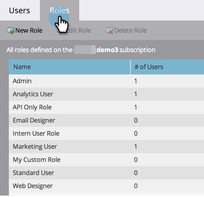

# 管理使用者角色和許可權 {#managing-user-roles-and-permissions}

設定、建立和編輯使用者角色，並將它們指派給使用者。 這可讓您控制每個Marketo使用者有權存取的區域與功能。

例如，行銷使用者通常需要跨應用程式的廣泛存取權，才能建立、修改和部署電子郵件、登入頁面和方案。 另一方面，網頁設計人員幾乎將所有時間都花在Design Studio中，建立資產以用於電子郵件和登陸頁面。 雖然公司領導在Analytics區域中廣泛使用Marketo的報告，但可能不需要自行建立或推動資產或計畫。

>[!NOTE]
>
>**需要管理員許可權**

Marketo提供數個內建角色，具有不同的存取層級：

* **管理員**  — 應用程式的所有部分，包括「管理員」區段
* **標準使用者**  — 應用程式的所有部分，除了管理員區段
* **行銷使用者**  — 應用程式的所有部分，除了管理員區段
* **網頁設計工具**  — 僅Design Studio
* **Analytics使用者**  — 僅限Analytics區段

您無法編輯「管理員」和「標準使用者」角色，但可以編輯其他角色。 您也可以建立新的自訂角色，以符合公司中的特定組織結構。

## 具有Adobe身分的Marketo {#marketo-with-adobe-identity}

如果您使用Marketo搭配Adobe身分，設定檔說明清單 [可在此處找到](/help/marketo/product-docs/administration/marketo-with-adobe-identity/adobe-identity-management-overview.md#profile-levels).

## 將角色指派給使用者 {#assign-roles-to-a-user}

您可以在下列情況下將角色指派給使用者： [第一次建立使用者](/help/marketo/product-docs/administration/users-and-roles/create-delete-edit-and-change-a-user-role.md) 或依據 [編輯現有使用者](/help/marketo/product-docs/administration/users-and-roles/managing-marketo-users.md).

1. 前往 **[!UICONTROL 管理員]** 區域。

   

1. 按一下 **[!UICONTROL 使用者和角色]**.

   

1. 從清單中選取您要編輯的使用者，然後按一下 **[!UICONTROL 編輯使用者]**.

   

1. 在 **[!UICONTROL 角色]**，根據使用者需要的許可權，選取您要指派給使用者的角色，然後按一下 **[!UICONTROL 儲存]**.

   

   >[!NOTE]
   >
   >若要瞭解每個角色，請參閱 [角色許可權說明](/help/marketo/product-docs/administration/users-and-roles/descriptions-of-role-permissions.md).

## 建立新角色 {#create-a-new-role}

有時候，您的組織會有具有非常特定角色的員工，這些角色需要自訂許可權組合。

1. 前往 **[!UICONTROL 管理員]** 區域。

   

1. 按一下 **[!UICONTROL 使用者和角色]**.

   

1. 按一下 **[!UICONTROL 角色]** 標籤。

   

1. 按一下 **[!UICONTROL 新角色]**.

   

1. 輸入 **[!UICONTROL 角色名稱]**， a **[!UICONTROL 說明]** （選擇性），然後選取此角色的使用者所需的許可權。

   

## 編輯角色 {#edit-a-role}

如果您需要變更與現有角色相關聯的許可權，可以編輯角色。

1. 前往 **[!UICONTROL 管理員]** 區域。

   

1. 按一下 **[!UICONTROL 使用者和角色]**.

   

1. 按一下 **[!UICONTROL 角色]** 標籤。

   

1. 從清單中，選取要修改的角色，然後按一下 **[!UICONTROL 編輯角色]**.

   

1. 變更 **[!UICONTROL 角色名稱]** 和 **[!UICONTROL 說明]** 如有必要，請變更關聯專案的選取範圍 **[!UICONTROL 許可權]**.

   

   >[!NOTE]
   >
   >擁有您編輯之角色的使用者在登出後再重新登入後，將會收到修改過的許可權。

## 刪除角色 {#delete-a-role}

如果某個角色變得不必要，您可以將其刪除。

1. 前往 **[!UICONTROL 管理員]** 區域。

   

1. 按一下 **[!UICONTROL 使用者和角色]**.

   

1. 按一下 **[!UICONTROL 角色]** 標籤。

   

1. 從清單中選取要刪除的角色，然後按一下 **[!UICONTROL 刪除角色]**.

   

1. 按一下 **[!UICONTROL 刪除]** 以確認。

   
