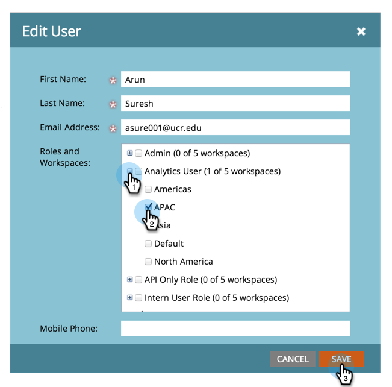

# 允許使用者存取Workspace {#allow-user-access-to-a-workspace}

工作區可以因任何原因（例如業務單位或地理區隔）。 他們會分隔每個團隊的資產（智慧清單、計畫等）。 以下說明如何授予使用者一或多個工作區的存取權。

>[!NOTE]
>
>**需要管理員許可權**

>[!NOTE]
>
>深入瞭解[工作區](/help/marketo/product-docs/administration/workspaces-and-person-partitions/understanding-workspaces-and-person-partitions.md)。

1. 移至&#x200B;**[!UICONTROL Admin]**&#x200B;區域。

   

1. 按一下「**[!UICONTROL Users & Roles]**」。

   

1. 在&#x200B;**[!UICONTROL Users]**&#x200B;標籤下，選取使用者並按一下&#x200B;**[!UICONTROL Edit User]**。

   

1. 選取您要讓使用者存取的&#x200B;**[!UICONTROL Roles and Workspaces]**。

   

   >[!NOTE]
   >
   >您可以允許使用者擁有對工作區的任何存取權組合。

儲存變更後，您應該會看到更新。

