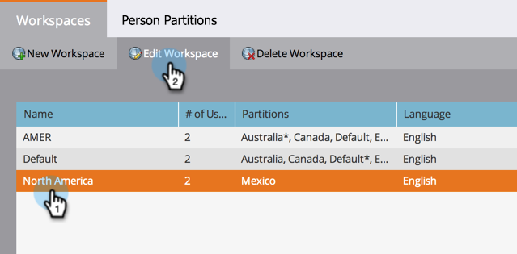

# 將人員分區分配給工作區{#assign-person-partitions-to-workspaces}

以下是如何編輯人員分區／工作區分配的方法：

>[!NOTE]
>
>**需要管理員權限**

>[!PREREQUISITES]
>
>[建立新工作區](/help/marketo/product-docs/administration/workspaces-and-person-partitions/create-a-new-workspace.md)

>[!CAUTION]
>
>工作區和人員分區可能很複雜。 請聯絡[Marketo支援](https://nation.marketo.com/t5/Support/ct-p/Support)以取得設定的協助。

1. 在「管理」下，按一下&#x200B;**工作區和分區**。

1. 選擇您的工作區，然後按一下「編輯工作區」(Edit Workspace)**。**

   

1. 編輯要更改的人員分區資訊。

   >[!NOTE]
   >
   >「所有人員分區」複選框表示此工作區有權訪問系統中的所有人員分區。

   

   主要人員分區是將輸入所有人員的預設設定。 使用[流步驟](/help/marketo/product-docs/core-marketo-concepts/smart-campaigns/flow-actions/use-add-choice-in-a-flow-step.md)或[分配規則](/help/marketo/product-docs/administration/workspaces-and-person-partitions/assigning-person-partitions-with-assignment-rules.md)來移動人員。

1. 按一下&#x200B;**保存**。

   

   儲存後，您應該會看到變更！

   

恭喜您！您已成功編輯您的工作區！

>[!MORELIKETHIS]
>
>[瞭解工作區和人員分區](/help/marketo/product-docs/administration/workspaces-and-person-partitions/understanding-workspaces-and-person-partitions.md)。
