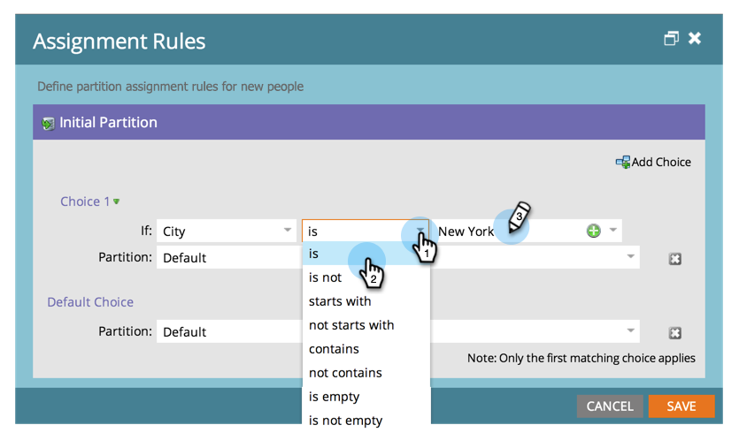

# 使用分配規則分配人員分區 {#assigning-person-partitions-with-assignment-rules}

>[!NOTE]
>
>**需要管理員權限**

>[!PREREQUISITES]
>
>* [建立人員分區](create-a-person-partition.md)

>

使用人員分區時，請設定分配規則，將從CRM建立的人員路由到其各自的分區。

>[!NOTE]
>
>只有從CRM和透過SOAP API在Marketto中建立的人員，才會套用指派規則。

1. 在「管理」下，按一下「工作區與分區」。

1. 在「**人員分區**」頁籤下，按一下「分配 **規則」**。

   

1. 按一下**新增選擇**以新增條件，將人員送入人員分區。

   

1. 選擇應建立條件的欄位。

   

1. 選擇選擇運算子並輸入值。
1. 

1. 選擇您希望符合條件的人員落入的人員分區。

   

   >[!NOTE]
   >
   >
   >您可以視需要新增多種選擇。

   按一下「儲存」。
   

就這樣！ 您已指派規則，將人員分區填入人員！

>[!NOTE]
>
>如果未符合任何先前的條件，則會套用預設選擇。

