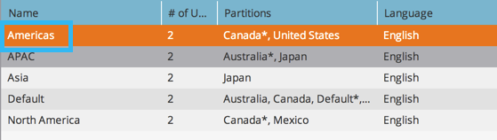

# 變更工作區的名稱 {#change-the-name-of-a-workspace}

>[!NOTE]
>
>**需要管理員權限**

>[!PREREQUISITES]
>
>[建立新的Workspace](/help/marketo/product-docs/administration/workspaces-and-person-partitions/create-a-new-workspace.md)

使用者可以變更工作區的名稱。 這相當簡單。

>[!NOTE]
>
>透過[瞭解Workspace和Person Partitions](/help/marketo/product-docs/administration/workspaces-and-person-partitions/understanding-workspaces-and-person-partitions.md)先瞭解。

1. 前往「**[!UICONTROL Admin]**」區域。

   

1. 按一下「**[!UICONTROL Workspaces & Partitions]**」。

   

1. 選取Workspace並按一下&#x200B;**[!UICONTROL Edit Workspace]**。

   

1. 為您的Workspace輸入新的&#x200B;**[!UICONTROL Name]**，然後按一下&#x200B;**[!UICONTROL Save]**。

   

儲存後，您應該會看到變更。

