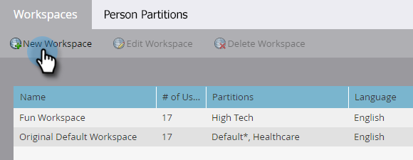

# 建立新的工作區 {#create-a-new-workspace}

工作區可用來將您的公司細分。 設定工作區的理由包括：

* 地理位置：歐洲行銷營運與北美行銷營運
* 業務單位A與業務單位B

以下說明如何建立新工作區。

>[!NOTE]
>
>**需要管理員許可權**

>[!NOTE]
>
>透過[瞭解Workspace和Person Partitions](/help/marketo/product-docs/administration/workspaces-and-person-partitions/understanding-workspaces-and-person-partitions.md){target="_blank"}先瞭解。

>[!TIP]
>
>若要進一步瞭解Workspace最佳實務，請連絡[Marketo Professional Services](https://business.adobe.com/tw/products/marketo/services-support.html){target="_blank"}。

1. 前往「**[!UICONTROL Admin]**」區域。

   

1. 按一下「**[!UICONTROL Workspaces & Partitions]**」。

   

1. 按一下「**[!UICONTROL New Workspace]**」。

   

1. 輸入&#x200B;**[!UICONTROL Name]**，然後選取您要使用的&#x200B;**[!UICONTROL Person Partitions]**。 選擇&#x200B;**[!UICONTROL Primary Person Partition]**。 若尚未建立，請務必[建立人員分割](/help/marketo/product-docs/administration/workspaces-and-person-partitions/create-a-person-partition.md){target="_blank"}。

   

   >[!NOTE]
   >
   >* **[!UICONTROL All Person Partitions]**&#x200B;核取方塊表示此工作區可以使用系統中的所有人員分割區。
   >
   >* **[!UICONTROL Primary Person Partition]**&#x200B;做為預設值，並將指派所有人員。

   >[!IMPORTANT]
   >
   >如果您已啟用多個品牌領域，則必須選擇主要品牌領域。

1. 選取工作區語言。

   

   >[!NOTE]
   >
   >建立後，Marketo將在工作區中植入範例資產。 語言允許這些內建物件使用非英文語言。

1. 按一下「**[!UICONTROL Create]**」。

   

視需要建立多個工作區，並將適當的人員分割指派給這些工作區。

建立工作區後，您應該會看到更新。

