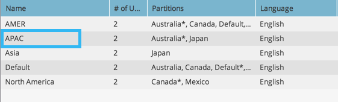

# 建立新工作區 {#create-a-new-workspace}

工作區可用來將您的公司細分。 設定工作區的理由包括：

* 地理位置：歐洲行銷營運與北美行銷營運
* 業務單位A與業務單位B

以下說明如何建立新工作區。

>[!NOTE]
>
>**需要管理員許可權**

>[!NOTE]
>
>首先瞭解 [瞭解工作區和人員資料分割](/help/marketo/product-docs/administration/workspaces-and-person-partitions/understanding-workspaces-and-person-partitions.md){target="_blank"}.

>[!TIP]
>
>若要進一步瞭解Workspace最佳實務，請聯絡 [Marketo專業服務](https://business.adobe.com/products/marketo/services-support.html){target="_blank"}.

1. 前往 **[!UICONTROL 管理員]** 區域。

   

1. 按一下 **[!UICONTROL 工作區與分割區]**.

   

1. 按一下 **[!UICONTROL 新工作區]**.

   

1. 輸入 **[!UICONTROL 名稱]**，然後選取 **[!UICONTROL 個人資料分割]** 您想要使用。 選擇 **[!UICONTROL 主要人員分割]**. 請確定 [建立人員資料分割](/help/marketo/product-docs/administration/workspaces-and-person-partitions/create-a-person-partition.md){target="_blank"} 如果您尚未這樣做。

   

   >[!NOTE]
   >
   >* 此 **[!UICONTROL 所有人員資料分割]** 核取方塊表示此工作區可以使用系統中的所有人員分割區。
   >
   >* 此 **[!UICONTROL 主要人員分割]** 會作為預設值，且是指派所有人員的位置。

   >[!IMPORTANT]
   >
   >如果您已啟用多個品牌領域，則必須選擇主要品牌領域。

1. 選取工作區語言。

   

   >[!NOTE]
   >
   >建立後，Marketo會在工作區中植入範例資產。 語言允許這些內建物件使用非英語語言。

1. 按一下 **[!UICONTROL 建立]**。

   

視需要建立多個工作區，並將適當的人員分割指派給這些工作區。

建立工作區後，您應會看到更新。

