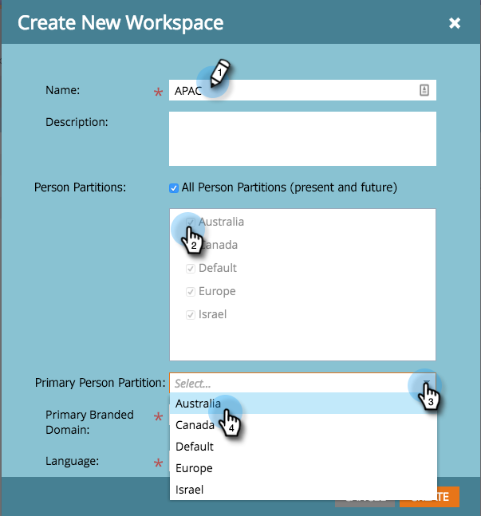

# 建立新工作區 {#create-a-new-workspace}

工作區可用來劃分公司。 設定工作區的原因包括：

* 地理位置：歐洲市場營銷運營與北美市場營銷運營
* 業務單元A與業務單元B

以下說明如何建立新工作區。

>[!NOTE]
>
>**需要管理權限**

>[!NOTE]
>
>先了解 [了解工作區和人員分區](/help/marketo/product-docs/administration/workspaces-and-person-partitions/understanding-workspaces-and-person-partitions.md){target="_blank"}.

>[!TIP]
>
>若要進一步了解工作區最佳實務，請聯絡 [Marketo Professional Services](https://business.adobe.com/products/marketo/services-support.html){target="_blank"}.

1. 前往 **管理** 的上界。

   

1. 按一下 **工作區與分區**.

   

1. 按一下 **新工作區**.

   

1. 輸入 **名稱**，然後選取 **人員分區** 您想要使用。 選擇 **主要人員分區**. 一定要 [建立人員分區](/help/marketo/product-docs/administration/workspaces-and-person-partitions/create-a-person-partition.md){target="_blank"} 如果你還沒有。

   

   >[!NOTE]
   >
   >* 此 **所有人員分區** 核取方塊表示此工作區可使用系統中的所有人員分區。
   >
   >* 此 **主要人員分區** 作為預設值，是所有人員的指派位置。

   >[!IMPORTANT]
   >
   >如果啟用了多個品牌域，則必須選擇主品牌域。

1. 選取工作區語言。

   

   >[!NOTE]
   >
   >建立後，Marketo會為工作區中的範例資產設定種子。 語言允許這些系統初始對象使用非英語語言。

1. 按一下 **建立**。

   

根據需要建立任意數量的工作區，並為其分配適當的人員分區。

建立工作區後，您應該會看到更新。

