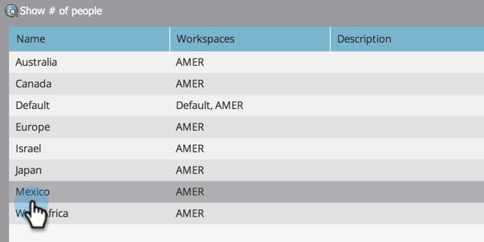

# 建立人員分割 {#create-a-person-partition}

按照以下步驟建立新的人員分割。

>[!NOTE]
>
>**需要管理員權限**

>[!NOTE]
>
>透過[瞭解Workspace和Person Partitions](/help/marketo/product-docs/administration/workspaces-and-person-partitions/understanding-workspaces-and-person-partitions.md)先瞭解。

1. 前往「**[!UICONTROL Admin]**」區域。

   

1. 按一下「**[!UICONTROL Workspaces & Partitions]**」。

   

1. 前往&#x200B;**[!UICONTROL Person Partitions]**&#x200B;標籤並按一下&#x200B;**[!UICONTROL New Person Partition]**。

   

1. 為磁碟分割命名，選擇要顯示磁碟分割的&#x200B;**[!UICONTROL Workspaces]**，然後按一下&#x200B;**[!UICONTROL Create]**。

   

建立資料分割之後，您應該會看到更新。

