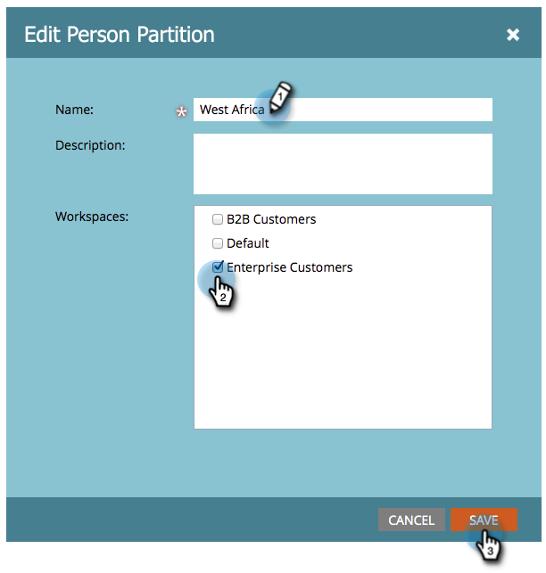

# 編輯現有的人員分割 {#edit-an-existing-person-partition}

個人資料分割就像擁有第二個（或第三個）資料庫。 分割區可以連結至一或多個工作區。 以下說明如何編輯分割區詳細資訊。

>[!NOTE]
>
>**需要管理員許可權**

>[!PREREQUISITES]
>
>[建立個人資料分割](/help/marketo/product-docs/administration/workspaces-and-person-partitions/create-a-person-partition.md){target="_blank"}

1. 前往 **[!UICONTROL 管理員]** 區域。

   

1. 按一下 **[!UICONTROL 工作區與分割區]**.

   

1. 在 **[!UICONTROL 個人資料分割]** 索引標籤中，選取您要編輯的人員分割，然後按一下 **[!UICONTROL 編輯人員分割]**.

   

1. 輸入人員分割 **[!UICONTROL 名稱]**，則 **[!UICONTROL 工作區]** 它們屬於，然後按一下 **[!UICONTROL 儲存]**.

   

儲存變更後，應該會看到更新！

