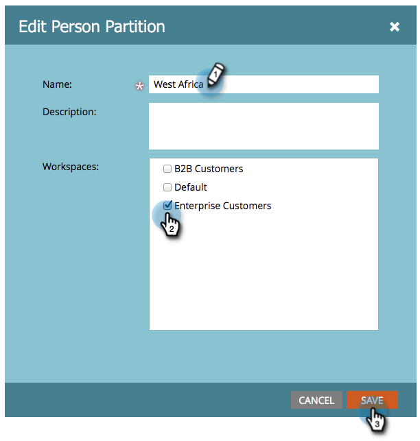

# 編輯現有的人員分割 {#edit-an-existing-person-partition}

個人資料分割就像擁有第二個（或第三個）資料庫。 分割區可以連結至一或多個工作區。

>[!NOTE]
>
>**需要管理員權限**

>[!PREREQUISITES]
>
>[建立人員分割](/help/marketo/product-docs/administration/workspaces-and-person-partitions/create-a-person-partition.md){target="_blank"}

1. 前往「**[!UICONTROL Admin]**」區域。

   

1. 按一下「**[!UICONTROL Workspaces & Partitions]**」。

   

1. 在&#x200B;**[!UICONTROL Person Partitions]**&#x200B;標籤下，選取要編輯的人員資料分割，然後按一下&#x200B;**[!UICONTROL Edit Person Partition]**。

   

1. 輸入人員資料分割&#x200B;**[!UICONTROL Name]**，也就是他們所屬的&#x200B;**[!UICONTROL Workspaces]**，然後按一下&#x200B;**[!UICONTROL Save]**。

   

儲存變更後，更新即會顯示。

