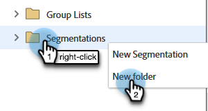
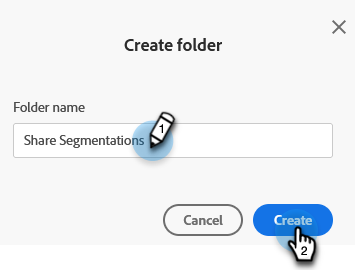

# 在工作區與分割區之間共用區段 {#share-segmentations-across-workspaces-and-partitions}

>[!PREREQUISITES]
>
>本文章僅適用於擁有工作區和分割區的客戶。

## 什麼是細分？ {#whats-a-segmentation}

Marketo擅長挑選適合的方案或智慧行銷活動的人員。 不過，對於較永久的角色，您應使用分段。 在Marketo中使用進階動態內容時需要這些變數。

>[!NOTE]
>
>瞭解 [如何建立分段](/help/marketo/product-docs/personalization/segmentation-and-snippets/segmentation/create-a-segmentation.md).

設定這些角色後(_和_ 您使用工作區)，您會想要在工作區之間共用這些工作區。 以下是一些需要瞭解的好事項：

## 規則和提示 {#rules-tips}

* 每個Marketo訂閱最多可包含多個工作區中的20個區段「總計」(**不是每個工作區20個**)。
* 您只能與您有權存取的工作區共用分段。
* 請務必建立並利用 **可檢視所有分割區的預設工作區**.

* 區段處理只會在建立區段的工作區中對其人員執行。

   * 建立您要在預設工作區中共用的區段。
      * 核准分段
      * 共用工作區會看到鎖定的資料夾，且區段為唯讀。
      * 無法編輯共用版本。 您只能編輯建立分段的原始分段。

   * 當您按一下共用區段內的區段（例如醫療保健）時，您看到的對象將只會是分割區中與您檢視的工作區相關聯的人員。
      * 如果您在Workspace 1 (WS1)中建立「分段」並與WS2共用，而WS1無法存取WS2的分割區，則不會重新計算「分段」。
      * 如果您在分割區有限的工作區中建立分段，然後與其他工作區共用，則收到共用分段的工作區將只會看到重疊的人員。

>[!NOTE]
>
>其中有些規則有點複雜。 開始使用的最簡單方法是與特定人員一起測試。 您一律可以建立新區段並移除舊區段。

## 範例情境 {#example-scenarios}

## 共用區段 {#share-a-segmentation}

1. 前往 **[!UICONTROL 資料庫]**.

   

1. 按一下右鍵 **[!UICONTROL 區段]** 並選取 **[!UICONTROL 新增資料夾]**.

   

1. 為您要在多個工作區中共用的資料夾命名（例如：共用區段），然後按一下 **[!UICONTROL 建立]**.

   

1. 將您要共用的區段移至資料夾。

   

1. 以滑鼠右鍵按一下資料夾，然後選取 **[!UICONTROL 共用資料夾]**.

   

1. 選取您要共用資料夾的工作區。 按一下 **[!UICONTROL 儲存]**.

   

   >[!NOTE]
   >
   >此對話方塊會顯示您有檢視許可權的工作區，因此Marketo建議從可檢視所有工作區和分割區的預設工作區建立和共用分割區。

原始資料夾會以箭頭顯示在「資料庫」樹狀結構中，指示它與其他工作區共用。 在共用工作區中，資料夾會以鎖定顯示，表示資料夾的內容已從其他工作區共用，且為唯讀。
