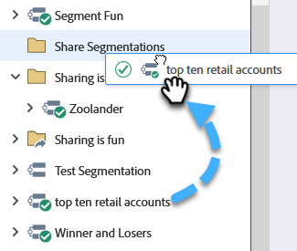

# 跨工作區和分割共用細分 {#share-segmentations-across-workspaces-and-partitions}

>[!PREREQUISITES]
>
>本文僅適用於擁有工作區和分割區的客戶。

## 什麼是細分？ {#whats-a-segmentation}

Marketo可識別適合方案或智慧型行銷活動的人員。 不過，對於較永久的角色，您應使用分段。 在Marketo中使用進階動態內容時需要這些屬性。

>[!NOTE]
>
>瞭解[如何建立分段](/help/marketo/product-docs/personalization/segmentation-and-snippets/segmentation/create-a-segmentation.md)。

一旦您設定了這些角色（_和_&#x200B;您使用工作區），您就會想要在工作區間共用它們。 以下是一些需要瞭解的好事項：

## 規則和提示 {#rules-tips}

* 每個Marketo訂閱最多可包含跨多個工作區的20個區段「總計」（**不是每個工作區** 20個）。
* 您只能和您有存取權的工作區共用分段。
* 建立並利用所有分割區&#x200B;**可見的**&#x200B;預設工作區。

* 區段處理只會在建立區段的工作區中的人員上執行。

   * 建立您要在預設Workspace內共用的區段。
      * 核准分段
      * 共用工作區會看到鎖定的資料夾，且區段為唯讀。
      * 無法編輯共用版本。 您只能編輯建立分段的原始分段。

   * 當您按一下共用區段內的區段（例如Healthcare）時，您看到的人將只會是資料分割中與您檢視的工作區相關聯的人。
      * 如果您在Workspace 1 (WS1)中建立分割並與WS2共用，而WS1沒有WS2之分割的存取權，則不會重新計算分割。
      * 如果您在分割區有限的工作區中建立分段，然後與其他工作區共用，則收到共用分段的工作區將只會看到重疊的人員。

>[!NOTE]
>
>其中有些規則相當複雜。 建議與特定人員一起測試。 您可以視需要建立新區段和刪除舊區段。

## 範例情境 {#example-scenarios}

## 共用區段 {#share-a-segmentation}

1. 移至&#x200B;**[!UICONTROL Database]**。

   

1. 用滑鼠右鍵按一下&#x200B;**[!UICONTROL Segmentations]**&#x200B;並選取&#x200B;**[!UICONTROL New Folder]**。

   

1. 為要在工作區之間共用的資料夾命名（例如：共用區段），然後按一下&#x200B;**[!UICONTROL Create]**。

   

1. 將您要共用的區段移至資料夾。

   

1. 以滑鼠右鍵按一下資料夾，然後選取 **[!UICONTROL Share Folder]**。

   

1. 選取您要共用資料夾的工作區。 按一下「**[!UICONTROL Save]**」。

   

   >[!NOTE]
   >
   >此對話方塊會顯示您有權檢視的工作區，因此Marketo建議從預設工作區建立和共用區段，讓所有工作區和分割區都可見。

原始資料夾會以箭頭顯示在「資料庫」樹狀結構中，指示它與其他工作區共用。 從共用工作區中，資料夾會顯示一個鎖定標籤，指出資料夾的內容已從另一個工作區共用，且為唯讀。
