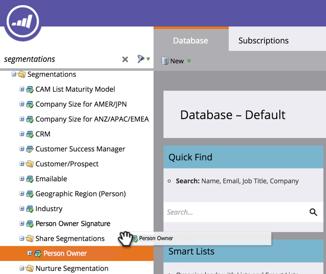

# 瞭解工作區和人員分區{#understanding-workspaces-and-person-partitions}

## 工作區{#workspaces}

>[!CAUTION]
>
>工作區的設定可能很複雜。 請聯絡[Marketo支援](https://nation.marketo.com/t5/Support/ct-p/Support)以瞭解這些服務是否適合您。

工作區是Marketo地區個別的區域，可存放程式、登陸頁面、電子郵件等行銷資產。 可供多人使用。 每位使用者都可存取一或多個工作區。

>[!NOTE]
>
>**範例**
>
>您使用工作區的一些原因：
>
>* 地理位置：歐洲、亞洲和北美行銷部門各有工作區
>* 業務單位：Quicken、Quickbooks和TurboTax各有一個工作區

>
>
在每種情況下，分離都是因為行銷資產完全不同。 如果他們共用行銷資產，則工作區可能不是適合您的工具。

>[!NOTE]
>
>瞭解如何建立[建立新工作區](/help/marketo/product-docs/administration/workspaces-and-person-partitions/create-a-new-workspace.md)。

## 跨工作區共用{#sharing-across-workspaces}

以下說明如何跨工作區共用資產。 對於您想要分享的任何內容，它都適用；此範例顯示區段。

>[!NOTE]
>
>包含資產的父資料夾是唯一可共用的資料夾，而非子資料夾。

1. 建立新資料夾。

   

1. 為要共用的資料夾命名。

   

1. 將您要共用的資產移入資料夾。

   

1. 按一下右鍵該資料夾並選擇&#x200B;**共用資料夾**。

   

1. 選擇要與共用資料夾的工作區，然後按一下&#x200B;**保存**。 「共用資料夾」對話方塊只會顯示您有權檢視的工作區。

   

   >[!NOTE]
   >
   >原始資料夾現在會有一個綠色的箭頭，表示已共用。 在共用工作區中，資料夾會有掛鎖，表示為唯讀。

您可以跨工作區共用這些項目。

* 電子郵件範本
* 著陸頁面範本
* 型號
* 智慧型宣傳
* [智慧型清單](/help/marketo/product-docs/core-marketo-concepts/smart-lists-and-static-lists/using-smart-lists/reference-a-list-or-smart-list-across-workspaces.md)
* [細分](/help/marketo/product-docs/administration/workspaces-and-person-partitions/share-segmentations-across-workspaces-and-partitions.md)
* 程式碼片段

## 跨工作區複製{#cloning-across-workspaces}

對於非範本的資產，最好將它們仿製為程式內的本機資產。  透過適當的存取層級，您可以將這些資產拖放至另一個工作區：

* 計畫
* 電子郵件
* 著陸頁面
* Forms

>[!NOTE]
>
>複製具有範本的資產時，這些範本必須與目標工作區共用。

## 將資產移至其他工作區{#moving-assets-to-other-workspaces}

若要將資產移至新工作區，請將資產放入檔案夾，然後將檔案夾拖曳至其他工作區。

>[!NOTE]
>
>不能將包含成員的程式從一個工作區移動到另一個工作區。

## 人員分區{#person-partitions}

人員分區的作用類似於單獨的資料庫。 每個分區都有自己的人員，他們不執行重複資料消除或與其他分區混用。 如果您認為您的業務使用案例可能需要使用相同的電子郵件地址重複記錄，請與[Marketo支援](https://nation.marketo.com/t5/Support/ct-p/Support)聯繫。

您可以在以下配置中將人員分區分配給[workspaces](create-a-new-workspace.md):

* 一個工作區到一個人員分區(1:1)
* 一個工作區到多個人員分區(1:x)
* 多個工作區到一個人員分區(x:1)

>[!NOTE]
>
>使用人員分區的原因：
>
>* 您的工作區不僅擁有不同的資產，而且不共用任何人
>* 您需要其他商業理由的復本

>[!CAUTION]
>
>人員分區不會彼此互動，因此在設定分區時要小心。

>[!NOTE]
>
>瞭解如何[建立人員分區](/help/marketo/product-docs/administration/workspaces-and-person-partitions/create-a-person-partition.md)。
