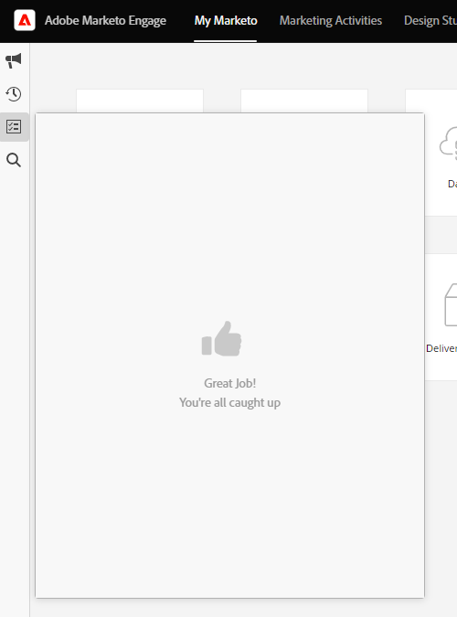

# Adobe Experience Cloud介面概述 {#adobe-experience-cloud-interface-overview}

Adobe Experience Cloud介面會協調Adobe Experience Cloud應用程式和服務的「殼層」外觀與風格。 但是，這不只是新設計。 這是單頁應用程式，可在單一執行個體中提供使用者體驗。

## 使用者流量 {#user-flow}

如果您尚未登入Adobe Experience Cloud產品，請直接登入 [!DNL Marketo Engage] 此處： [https://experience.adobe.com/marketo-engage](https://experience.adobe.com/marketo-engage).

若您 _為_ 已登入Adobe Experience Cloud產品，只要按一下功能表圖示並選取 **[!DNL Marketo Engage]**.

>[!NOTE]
>
>您的下拉式功能表可能會根據您訂閱的Adobe Experience Cloud產品而有所不同。

## 新功能 {#new-features}

除了更新的外觀和風格外，您還會注意到下列功能：

**整合式說明中心**

從中存取各種可用的說明資源 [!DNL Marketo Engage] 應用程式。

**應用程式切換器**

那些可存取多種Adobe產品的使用者，將可輕鬆切換。

**通知與公告**

直接在應用程式中檢視產品特定通知和一般Adobe產品公告，並與之互動。

**Adobe設定**

按一下您的設定檔圖示以變更您的語言或其他Adobe範圍的偏好設定。

## 常見問題集 {#faq}

**無法登錄 [!DNL Marketo Engage] 透過Experience Cloud介面。 問題可能是什麼？**

如果您可以登入Adobe Experience Cloud，但接著看到「無法載入頁面」錯誤，則問題可能發生在 [!DNL Marketo Engage] 側。 請聯繫 [Marketo支援](https://nation.marketo.com/t5/support/ct-p/Support) 以求協助。

**使用者歷史記錄、全域搜尋、Marketo通知和任務匣移至何處？**

這些功能已從頂端導覽列移至Experience Cloud介面左側的新列。

