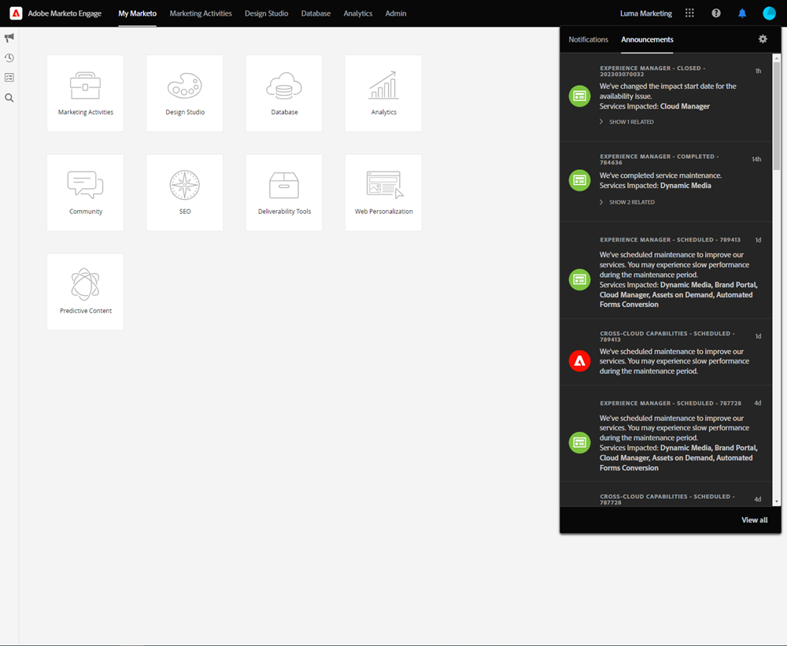

# Adobe Experience Cloud 介面概觀 {#adobe-experience-cloud-interface-overview}

Adobe Experience Cloud 介面與 Adobe Experience Cloud 應用程式及服務的「shell」外觀保持一致。 但是，這不僅僅是新設計。 這是一種單頁應用程式，可在單一執行個體中提供使用者體驗。

## 使用者流程 {#user-flow}

如果您尚未登入Adobe Experience Cloud產品，請直接在此登入[!DNL Marketo Engage]： [https://experience.adobe.com/marketo-engage](https://experience.adobe.com/marketo-engage)。

如果您&#x200B;_已_&#x200B;登入Adobe Experience Cloud產品，請按一下功能表圖示並選取&#x200B;**[!DNL Marketo Engage]**。

>[!NOTE]
>
>您的下拉式功能表可能會根據您訂閱的Adobe Experience Cloud產品而有所不同。

## 新功能 {#new-features}

除了已更新的外觀和風格，還提供下列功能：

**整合式說明中心**

從 [!DNL Marketo Engage] 應用程式內部存取各種可用的說明資源。

**應用程式切換器**

具備多項 Adobe 產品之存取權的使用者能夠輕鬆地在產品之間切換。

**通知和公告**

直接在應用程式中檢視產品特定通知和一般 Adobe 產品公告，並進行互動。

**Adobe 設定**

按一下您的設定檔圖示即可變更您的語言或其他 Adobe 全域偏好設定。

## 常見問題集 {#faq}

**我無法透過Experience Cloud介面登入[!DNL Marketo Engage]。 可能是什麼問題造成？**

若您可以登入 Adobe Experience Cloud，但隨後看到「無法載入頁面」錯誤，則問題可能出在 [!DNL Marketo Engage] 方面。 請連絡[Marketo支援](https://nation.marketo.com/t5/support/ct-p/Support)以取得協助。

**使用者歷史記錄、全域搜尋、Marketo 通知以及工作匣都到哪裡去了？**

這些功能已從頂部導覽移至 Experience Cloud 介面左側的新列中。

