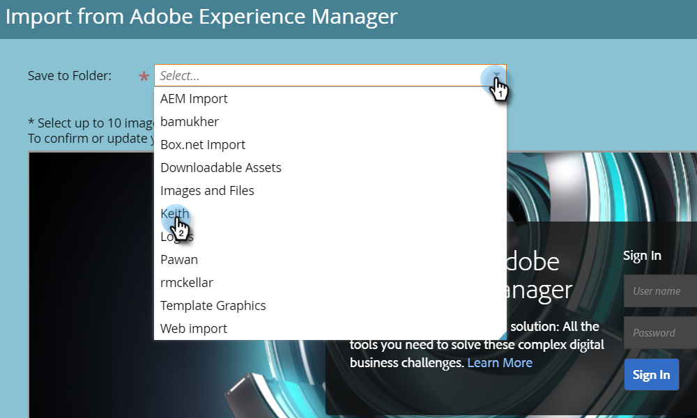

# 使用Adobe Experience Manager匯入資產 {#importing-assets-with-adobe-experience-manager}

資產選擇器可讓Marketo客戶存取、選取AEM資產，並將其匯入Marketo [!DNL Design Studio]. **需要管理員許可權**.

>[!AVAILABILITY]
>
>並非每個人都購買過此功能。 如需詳細資訊，請聯絡Adobe客戶團隊（您的客戶經理）。

>[!PREREQUISITES]
>
>確定您已執行 [AEM設定](/help/marketo/product-docs/core-marketo-concepts/miscellaneous/configuring-adobe-experience-manager-integration.md).

>[!IMPORTANT]
>
>目前僅完全支援此功能 [!DNL Firefox]. 不支援此功能 [!DNL Safari]，且最新版本的 [!DNL Chrome]，根據您的 [!DNL SameSite] Cookie設定。

1. 按一下 **[!UICONTROL Design Studio]**.

   

1. 按一下新增下拉式清單，然後選取 **[!UICONTROL 從Adobe Experience Manager匯入]**.

   

1. 選擇影像將儲存到的資料夾。

   

1. 登入Adobe Experience Manager （如果尚未登入）。

   

1. 選擇您的資料夾。 然後，按一下縮圖來選取您想要的影像（您最多可以選擇10張）。 按一下 **[!UICONTROL 選取]** 完成時。

   

   >[!NOTE]
   >
   >影像大小不能超過100MB。

1. 按一下 **[!UICONTROL 匯入]** 以完成程式。

   

   就是這樣！ 按一下 **[!UICONTROL 關閉]** 以返回Design Studio。

   

## 注意事項 {#things-to-note}

* Marketo目前支援Adobe Experience Manager 6.4和6.5版。

* 您執行個體中的所有使用者都可以檢視/存取您匯入的影像。

* 不會自動更新影像。 如果您將影像匯入Marketo [!DNL Design Studio] 在AEM中更新，您必須手動將其重新匯入Marketo。
